# Thiết kế trò chơi trí nhớ ôn tập Toán: 🏝️ Đảo Trí Nhớ (Lớp 1 → Lớp 5)

> Trạng thái (2026-10-06): **đã code trạm đầu tiên 🃏 Bãi Lật Thẻ, lớp 3, chỉ bật ở bản dev** (cờ `MEMORY_ISLAND`), chờ duyệt rồi mới làm trạm khác. Xem [§14.6](#146-đã-làm-giai-đoạn-1). Các câu khác ở [§17](#17-câu-hỏi-cần-chốt) vẫn cần chốt.
>
> Phạm vi: **lớp 1 trở lên** (không làm cho Tiền tiểu học). Nội dung lấy từ các sách đang có trong app: Vở BT Toán 1 Tập 1, Vở BT Toán 2 Tập 1 + 2, Vở BT Toán 3 Tập 1 + 2, Toán 4 công cụ Tập 1, Toán 5 công cụ Tập 1.
>
> Khung chung dùng lại của trò chơi lớp 2, 3 ([lop_3/thiet-ke-tro-choi-tap1.md](lop_3/thiet-ke-tro-choi-tap1.md)): không khóa, thẻ giới thiệu "phù hợp nếu em đã học Bài …", sao, sticker, bảng xếp hạng. Bố cục màn hình theo skill `game-screen-layout`.
>
> Hình minh hoạ nằm ở [docs/tro-choi-tri-nho/](tro-choi-tri-nho/), là **mockup để duyệt ý tưởng**, chưa phải hình thật trong app.

---

## Mục lục

1. [Ý tưởng chính](#1-ý-tưởng-chính)
2. [Thẻ kiến thức: một đơn vị dùng cho mọi trạm](#2-thẻ-kiến-thức-một-đơn-vị-dùng-cho-mọi-trạm)
3. [Flow tổng](#3-flow-tổng)
4. [Chọn kiến thức: một chủ đề, trộn, chuyến đi hôm nay](#4-chọn-kiến-thức-một-chủ-đề-trộn-chuyến-đi-hôm-nay)
5. [Level: Đường phiêu lưu](#5-level-đường-phiêu-lưu)
6. [Trạm 1: 🃏 Bãi Lật Thẻ](#6-trạm-1--bãi-lật-thẻ)
7. [Trạm 2: 🙈 Khỉ Giấu Thẻ](#7-trạm-2--khỉ-giấu-thẻ)
8. [Trạm 3: 🔦 Hang Đom Đóm](#8-trạm-3--hang-đom-đóm)
9. [Trạm 4: 🎵 Đàn Đá](#9-trạm-4--đàn-đá)
10. [Trạm 5: 🐢 Rùa Nhớ Đường](#10-trạm-5--rùa-nhớ-đường)
11. [💎 Rương kho báu: ôn cách quãng nhiều ngày](#11--rương-kho-báu-ôn-cách-quãng-nhiều-ngày)
12. [Bộ thẻ theo lớp](#12-bộ-thẻ-theo-lớp)
13. [Hướng dẫn, giọng đọc, chuyển động, phần thưởng](#13-hướng-dẫn-giọng-đọc-chuyển-động-phần-thưởng)
14. [Kỹ thuật và lộ trình](#14-kỹ-thuật-và-lộ-trình)
15. [Vị trí trong app và 🏫 Chơi cả lớp](#15-vị-trí-trong-app-và--chơi-cả-lớp)
16. [Tham khảo Lumosity và các game nhận thức](#16-tham-khảo-lumosity-và-các-game-nhận-thức)
17. [Câu hỏi cần chốt](#17-câu-hỏi-cần-chốt)

---

## 1. Ý tưởng chính

Toán tiểu học có rất nhiều thứ **cần nhớ thuộc** để làm bài nhanh: bảng cộng, bảng nhân chia, đổi đơn vị, đọc số, xem đồng hồ, phân số bằng nhau, công thức diện tích… Trò chơi trí nhớ thông thường chỉ luyện nhớ hình. Ở đây ta đổi luật để **muốn nhớ được thì phải biết kiến thức**:

| Trò trí nhớ thông thường | Đảo Trí Nhớ |
|---|---|
| Hai thẻ giống hệt nhau là một cặp | Hai thẻ **bằng nhau** là một cặp: `7 × 8` với `56`, `1 kg` với `1 000 g`, đồng hồ kim với `8 giờ 30 phút` |
| Nhớ thẻ đã biến mất | Nhớ thẻ biến mất rồi chọn **mặt kia** của nó (thẻ `36` bị giấu, bé chọn `4 × 9`) |
| Nhớ chuỗi đèn | Nhớ chuỗi số có **quy luật** (đếm thêm 3, bảng nhân 4) |
| Chơi xong là hết | Thẻ bé hay quên **quay lại** vào những ngày sau (Rương kho báu) |

**Một trò, năm trạm, chung một kho thẻ.** Trò tên là **🏝️ Đảo Trí Nhớ**. Trên đảo có 5 trạm chơi, mỗi trạm luyện một kiểu trí nhớ. Mọi trạm dùng chung **kho thẻ kiến thức** của lớp, nên bé có thể:

- **Ôn một chủ đề** (chỉ bảng nhân 7) ở bất kỳ trạm nào,
- **Trộn nhiều chủ đề** trong cùng một ván (bảng nhân + đổi đơn vị + số La Mã),
- Đi theo **🗺️ Đường phiêu lưu**: các level xếp theo thứ tự Bài trong sách, độ khó tăng dần (§5),
- Bấm **⛵ Chuyến đi hôm nay** để app tự chọn 3 trạm và tự trộn thẻ: thẻ sắp quên, bài vừa học, thẻ cũ.

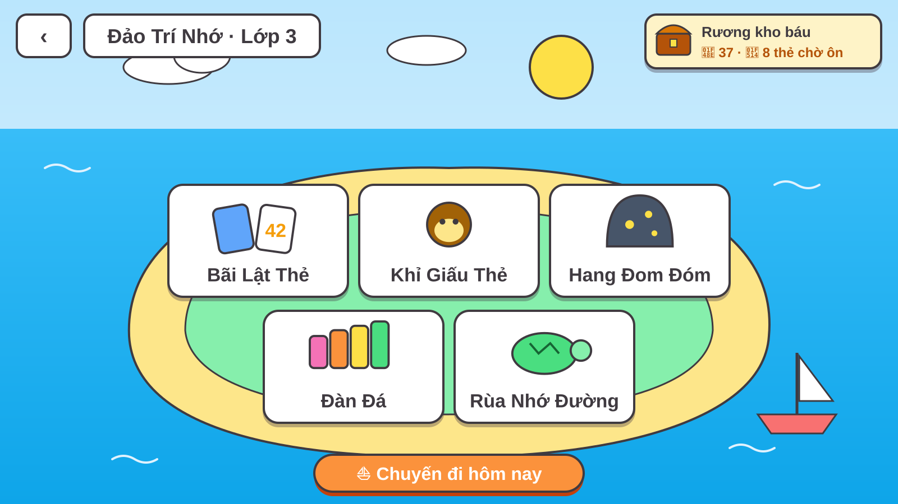

*Hình 1. Màn bản đồ (ngang). Mỗi trạm là một nút to. Góc phải là Rương kho báu với số thẻ chờ ôn. Nút cam dưới cùng là Chuyến đi hôm nay.*

### Trạm nào cho lớp nào

| Trạm | Kiểu trí nhớ | Lớp 1 | Lớp 2 | Lớp 3 | Lớp 4 | Lớp 5 |
|---|---|:-:|:-:|:-:|:-:|:-:|
| 🃏 Bãi Lật Thẻ | Nhớ vị trí + ghép cặp bằng nhau | ✓ (3–4 cặp) | ✓ (6 cặp) | ✓ (6 cặp) | ✓ (8 cặp) | ✓ (8 cặp) |
| 🙈 Khỉ Giấu Thẻ | Nhớ một nhóm thẻ, tìm thẻ thiếu | ✓ (4 thẻ) | ✓ (6) | ✓ (6) | ✓ (8) | ✓ (8) |
| 🔦 Hang Đom Đóm | Nhớ hình nhìn chớp nhoáng | ✓ | ✓ | ✓ | ✓ | ✓ |
| 🎵 Đàn Đá | Nhớ chuỗi có quy luật | ✓ (đếm thêm 1, 2) | ✓ | ✓ | ✓ | ✓ |
| 🐢 Rùa Nhớ Đường | Nhớ đường đi + tính nhẩm nhiều bước | | ✓ (cộng, trừ) | ✓ | ✓ | ✓ |

Mọi trạm đều mở, không khóa. Lớp 1 chưa thấy Rùa Nhớ Đường vì chưa học tính nhiều bước.

---

## 2. Thẻ kiến thức: một đơn vị dùng cho mọi trạm

### 2.1 Thẻ và mặt thẻ

Một **thẻ kiến thức** (fact) là một điều bé cần nhớ. Mỗi thẻ có **2 mặt trở lên**, là các cách viết / vẽ khác nhau của cùng một giá trị:

```
Thẻ "7 × 8 = 56"          Thẻ "1 kg = 1 000 g"        Thẻ "một phần ba"
┌────────┐ ┌────────┐     ┌────────┐ ┌─────────┐      ┌────────┐ ┌────────┐
│ ✖️      │ │ ✖️      │     │ ⚖️      │ │ ⚖️       │      │ 🍰     │ │ 🍰     │
│ 7 × 8  │ │   56   │     │  1 kg  │ │ 1 000 g │      │  (◔)   │ │  1     │
│        │ │        │     │        │ │         │      │        │ │  ─     │
│ (xanh) │ │  (cam) │     │ (xanh) │ │  (cam)  │      │ (xanh) │ │  3 cam │
└────────┘ └────────┘     └────────┘ └─────────┘      └────────┘ └────────┘
  mặt "hỏi"   mặt "đáp"
```

- **Mặt hỏi** (viền xanh dương): phép tính, hình, đồng hồ, khối trăm chục, số La Mã, đơn vị lớn.
- **Mặt đáp** (viền cam): số, cách đọc, đơn vị nhỏ, phân số.
- **Biểu tượng chủ đề** ở góc trên trái (✖️ nhân chia, ➕ cộng trừ, ⚖️ khối lượng, 💧 dung tích, 📏 độ dài, 🕐 thời gian, 🍰 phân số, 🏛️ La Mã, 🔷 hình…). Khi trộn kiến thức, biểu tượng giúp bé biết thẻ thuộc chủ đề nào.
- Một cặp luôn là **1 xanh + 1 cam**, nên bé lớp 1, 2 chỉ cần lật xanh rồi tìm cam. Riêng **bộ ba** (lớp 3+) có thể có 2 mặt cam: `0,5`, `1/2`, `50 %`.

### 2.2 Các loại mặt thẻ (vẽ bằng SVG, dùng lại hình đã có)

| Loại mặt | Ví dụ | Lấy từ |
|---|---|---|
| Số, phép tính | `56`, `7 × 8`, `2 050 300` | chữ |
| Chữ đọc (có 🔊) | "ba trăm linh năm" | `engine/i18n` + TTS |
| Chấm / khung 10 ô | ●●●●● ●●○○○ | vẽ mới, đơn giản |
| Que tính, thanh chục, khối trăm | 3 thanh chục + 4 que | kit khối của Lớp 2 Bài 48 |
| Đồng hồ kim | 8:30 | kit đồng hồ (kim không che số, theo quy tắc đồng hồ) |
| Tờ tiền | 500 đồng | hình tiền tự vẽ của Lớp 2 Bài 56 |
| Hình tô phân số | hình tròn tô 1/3 | kit phân số lớp 3, 5 |
| Phân số đứng | 1 trên 3 | như sách, không viết `1/3` ngang |
| Hình phẳng, khối, góc | góc tù, hình thang | kit hình lớp 3, 4 |
| Nhiệt kế, cân, bình | 25 °C | kit đo lường |

### 2.3 Luật để trộn không bị nhầm

Khi nhiều chủ đề nằm chung một bàn, app phải bảo đảm **mỗi mặt chỉ ghép được với đúng một mặt**:

- Mỗi mặt có một **khoá giá trị** (`56`, `1000g`, `1/3`). Không cho hai thẻ trên cùng bàn có chung khoá. Ví dụ không để `7 × 8` và `8 × 7` cùng bàn (đều là 56), không để `3 × 3` và `IX` cùng bàn (đều là 9).
- Phân số bằng nhau (`1/2`, `2/4`) chỉ cùng bàn khi đang chơi **bộ ba** và chúng là cùng một nhóm.
- Ở chế độ trộn: mỗi chủ đề **không quá một nửa** số thẻ, và có **ít nhất 2 chủ đề**.
- Chỉ lấy chủ đề có Bài **thuộc lớp đang chọn hoặc lớp dưới**. Không lấy bài bé chưa tới (xem cách biết "đã học" ở §4.4).

---

## 3. Flow tổng

### 3.1 Từ đâu vào game

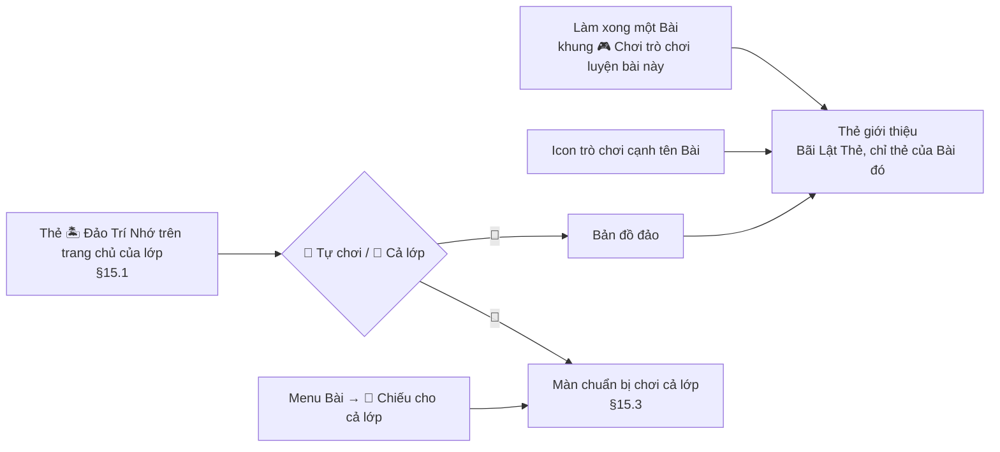
```mermaid
flowchart LR
    M[Bản đồ đảo]
    B[Làm xong một Bài<br/>khung 🎮 Chơi trò chơi luyện bài này] --> F[Thẻ giới thiệu<br/>Bãi Lật Thẻ, chỉ thẻ của Bài đó]
    C[Icon trò chơi cạnh tên Bài] --> F
    D[Thẻ 🏝️ Đảo Trí Nhớ trên trang chủ của lớp<br/>§15.1] --> CH{👦 Tự chơi / 🏫 Cả lớp}
    CH -->|👦| M
    CH -->|🏫| CL[Màn chuẩn bị chơi cả lớp<br/>§15.3]
    E[Menu Bài → 🏫 Chiếu cho cả lớp] --> CL
    M --> F
```

- Vào từ **một Bài** thì bộ thẻ chỉ gồm thẻ của Bài đó (giống `game.focus` của các trò hiện có), chơi ngay Bãi Lật Thẻ.
- Vào từ **thẻ trên trang chủ** thì chọn 👦 Tự chơi (tới bản đồ) hoặc 🏫 Chơi cả lớp (§15).
- Lớp lấy từ hồ sơ. Ở thanh trên có nút đổi lớp để ôn lại kiến thức lớp dưới.

### 3.2 Vòng chơi chính

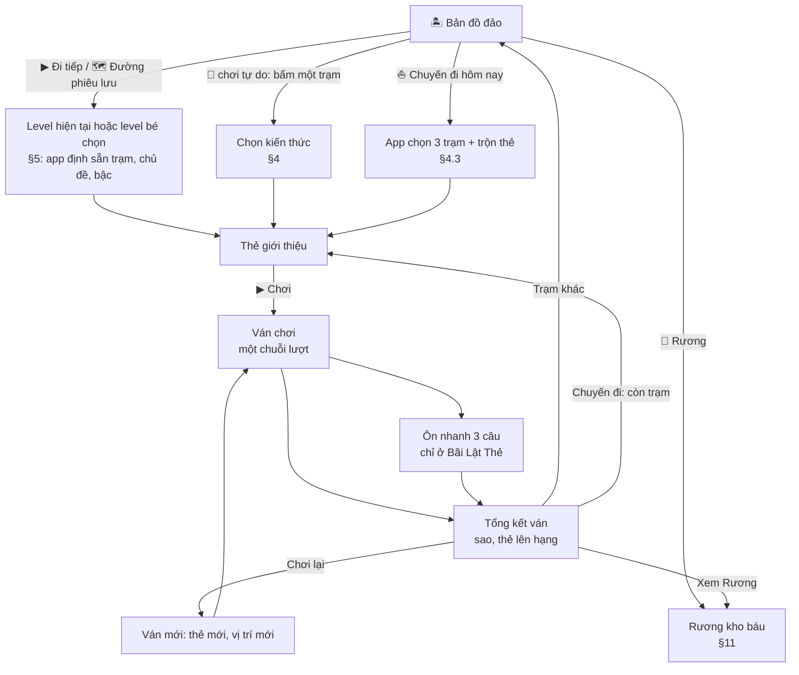
```mermaid
flowchart TD
    M[🏝️ Bản đồ đảo] -->|▶ Đi tiếp / 🗺️ Đường phiêu lưu| LV[Level hiện tại hoặc level bé chọn<br/>§5: app định sẵn trạm, chủ đề, bậc]
    LV --> I
    M[🏝️ Bản đồ đảo] -->|🎲 chơi tự do: bấm một trạm| K[Chọn kiến thức<br/>§4]
    M -->|⛵ Chuyến đi hôm nay| J[App chọn 3 trạm + trộn thẻ<br/>§4.3]
    M -->|💎 Rương| R[Rương kho báu<br/>§11]
    K --> I[Thẻ giới thiệu]
    J --> I
    I -->|▶ Chơi| V[Ván chơi<br/>một chuỗi lượt]
    V --> Q[Ôn nhanh 3 câu<br/>chỉ ở Bãi Lật Thẻ]
    V --> S
    Q --> S[Tổng kết ván<br/>sao, thẻ lên hạng]
    S -->|Chơi lại| V2[Ván mới: thẻ mới, vị trí mới] --> V
    S -->|Trạm khác| M
    S -->|Chuyến đi: còn trạm| I
    S -->|Xem Rương| R
```

### 3.3 Thẻ giới thiệu (trước mỗi ván)

```
┌──────────────────────────────────────────────────────────────┐
│  🃏  Bãi Lật Thẻ                                              │
│                                                              │
│   [✖️ Bảng nhân 7]  [⚖️ Gam, ki-lô-gam]  [🏛️ Số La Mã]          │
│                                                              │
│   Phù hợp nếu em đã học Bài 10, 31 (Tập Một), Bài 47 (Tập Hai) │
│   ✓ Em đã làm Bài 10, Bài 31                                 │
│                                                              │
│   [ 👆 lật 2 thẻ ] → [ 🟦 = 🟧 bay lên dây ] → [ 🏆 hết thẻ ]  │  ← dải hình hướng dẫn
│                                                              │
│      ┌──────────────┐        ┌──────────────────┐            │
│      │   ▶  Chơi     │        │ 📖 Xem lại Bài 10 │            │
│      └──────────────┘        └──────────────────┘            │
└──────────────────────────────────────────────────────────────┘
```

- Giọng đọc đọc tên trạm và câu hướng dẫn một lần.
- "📖 Xem lại Bài" mở đúng thẻ sách (như trò chơi lớp 2, 3).

### 3.4 Tổng kết ván

```
┌──────────────────────────────────────────────────────────────┐
│                     ⭐ ⭐ ⭐                                    │
│          Em tìm được 6 cặp sau 16 lần lật!                    │
│          Kỷ lục cũ: 20 lần lật  →  🎉 Kỷ lục mới                │
│                                                              │
│   Thẻ lên hạng trong Rương:                                    │
│   🥈→🥇 7 × 8 = 56     🪨→🥉 1 kg = 1 000 g    🥉→🥈 IX = 9          │
│   Thẻ cần ôn thêm:  ⚠️ 7 × 6 = 42                              │
│                                                              │
│   [ 🔁 Chơi lại ]   [ 🏝️ Trạm khác ]   [ 💎 Xem Rương ]           │
└──────────────────────────────────────────────────────────────┘
```

Thẻ tổng kết **phủ lên vùng bàn chơi đã trống**, không đẩy bố cục (quy tắc `game-screen-layout` §4).

---

## 4. Chọn kiến thức: một chủ đề, trộn, chuyến đi hôm nay

### 4.1 Màn "Túi thẻ"

Sau khi bấm một trạm, bé chọn bỏ thẻ gì vào túi:

```
┌──────────────────────────────────────────────────────────────────────┐
│ ‹  Túi thẻ · Lớp 3                                       🔊           │
├──────────────────────────────────────────────────────────────────────┤
│  ┌──────────────────────┐ ┌──────────────────────┐ ┌───────────────┐ │
│  │ 🔀 Trộn tất cả        │ │ 🎯 Chỗ em hay quên    │ │ 📖 Bài vừa học  │ │  ← 3 lối tắt
│  │   bài đã học          │ │   8 thẻ               │ │  Bài 31 Gam     │ │
│  └──────────────────────┘ └──────────────────────┘ └───────────────┘ │
│                                                                      │
│  Hoặc chọn chủ đề (chọn được nhiều):                                 │
│  ┌──────────┐ ┌──────────┐ ┌──────────┐ ┌──────────┐ ┌──────────┐   │
│  │ ✖️ Bảng 6 │ │ ✖️ Bảng 7 │ │ ✖️ Bảng 8 │ │ ✖️ Bảng 9 │ │ 🍰 Một    │   │
│  │ Bài 9     │ │ Bài 10 ✓ │ │ Bài 11    │ │ Bài 12    │ │ phần mấy │   │
│  │ 💎▓▓▓░░   │ │ 💎▓▓░░░ ✔ │ │ 💎░░░░░   │ │ 💎░░░░░   │ │ 💎▓░░░░   │   │
│  └──────────┘ └──────────┘ └──────────┘ └──────────┘ └──────────┘   │
│  ┌──────────┐ ┌──────────┐ ┌──────────┐ ┌──────────┐ ┌──────────┐   │
│  │ 📏 mm, cm │ │ ⚖️ g, kg ✔│ │ 💧 ml, l  │ │ 🏛️ La Mã ✔│ │ 🔷 Hình   │   │
│  └──────────┘ └──────────┘ └──────────┘ └──────────┘ └──────────┘   │
├──────────────────────────────────────────────────────────────────────┤
│   Đã chọn: ✖️ Bảng 7 · ⚖️ g, kg · 🏛️ La Mã        [   ▶ Chơi   ]       │  ← vùng cố định
└──────────────────────────────────────────────────────────────────────┘
```

- Mỗi chủ đề là **một nút to**; trong nút có tên Bài, dấu ✓ nếu đã làm Bài đó, và thanh 💎 cho biết bé đã thuộc bao nhiêu thẻ của chủ đề.
- Chọn **1 chủ đề** = ôn một chủ đề. Chọn **2 chủ đề trở lên** = trộn.
- Ba lối tắt: **Trộn tất cả bài đã học**, **Chỗ em hay quên** (thẻ hạng thấp trong Rương), **Bài vừa học** (Bài làm gần nhất trong sách).
- Thanh dưới luôn chiếm chỗ từ đầu (không hiện / ẩn), nút Chơi mờ khi chưa chọn gì.
- Lớp 1: màn này chỉ có 3 lối tắt + 4–5 chủ đề to có hình, không bắt đọc chữ.

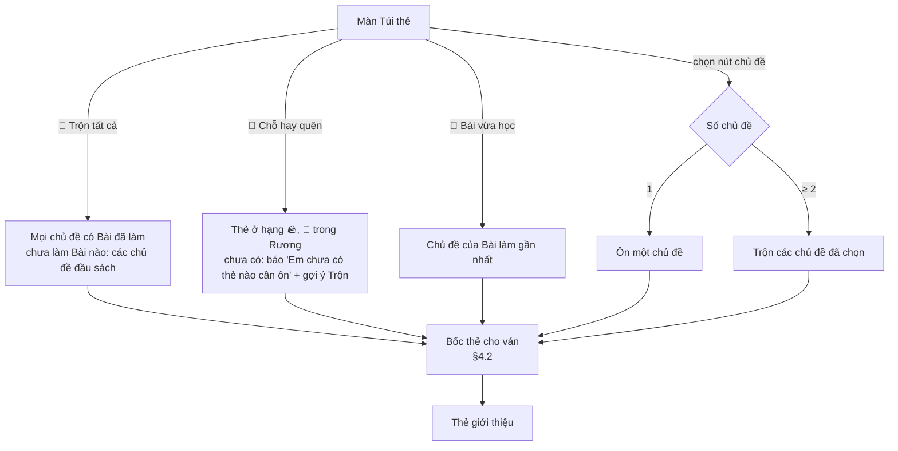
```mermaid
flowchart TD
    T[Màn Túi thẻ] -->|🔀 Trộn tất cả| A1[Mọi chủ đề có Bài đã làm<br/>chưa làm Bài nào: các chủ đề đầu sách]
    T -->|🎯 Chỗ hay quên| A2[Thẻ ở hạng 🪨, 🥉 trong Rương<br/>chưa có: báo 'Em chưa có thẻ nào cần ôn' + gợi ý Trộn]
    T -->|📖 Bài vừa học| A3[Chủ đề của Bài làm gần nhất]
    T -->|chọn nút chủ đề| A4{Số chủ đề}
    A4 -->|1| A5[Ôn một chủ đề]
    A4 -->|≥ 2| A6[Trộn các chủ đề đã chọn]
    A1 & A2 & A3 & A5 & A6 --> P[Bốc thẻ cho ván<br/>§4.2]
    P --> I[Thẻ giới thiệu]
```

### 4.2 Cách bốc thẻ cho một ván

```
bocThe(chủ đề đã chọn, số thẻ cần N):
  1. Gom mọi thẻ của các chủ đề đã chọn.
  2. Chia làm 3 rổ:
       rổ A: thẻ đến hạn ôn trong Rương (hạng thấp trước)
       rổ B: thẻ chưa gặp lần nào
       rổ C: thẻ đã thuộc (🥇, 💎), để giữ cho khỏi quên
  3. Lấy lần lượt: tối đa 60% từ A, rồi B, rồi C cho đủ N.
  4. Trộn nhiều chủ đề: xoay vòng giữa các chủ đề để mỗi chủ đề ≤ 50%.
  5. Bỏ thẻ nào có khoá giá trị trùng thẻ đã lấy (§2.3), lấy thẻ khác thay.
  6. Xáo vị trí bằng RNG có seed.
```

### 4.3 ⛵ Chuyến đi hôm nay

Lối chơi "một chạm" cho bé mỗi ngày, khoảng **6–8 phút**:

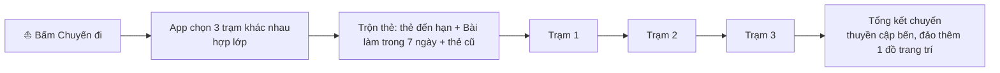
```mermaid
flowchart LR
    S[⛵ Bấm Chuyến đi] --> P1[App chọn 3 trạm khác nhau<br/>hợp lớp]
    P1 --> P2[Trộn thẻ: thẻ đến hạn + Bài làm trong 7 ngày + thẻ cũ]
    P2 --> T1[Trạm 1] --> T2[Trạm 2] --> T3[Trạm 3]
    T3 --> E[Tổng kết chuyến<br/>thuyền cập bến, đảo thêm 1 đồ trang trí]
```

- Giữa các trạm có cảnh **thuyền chạy** sang trạm kế (2 giây), thanh tiến độ ⛵──●──○──○.
- Mỗi trạm ngắn hơn ván thường (Bãi Lật Thẻ 4 cặp, Khỉ 3 lượt, Hang 4 hình…).
- Xong chuyến: đảo được thêm **một món trang trí** (cờ, hải đăng, nhà sàn, đèn lồng, cầu tàu…), một món mỗi ngày. Bé thấy đảo của mình lớn dần theo số ngày chơi.

### 4.4 Biết bé "đã học" Bài nào

- Đọc tiến độ sách đang có: `g1w-progress-v1`, `g2w-progress-v1`, `g2w2-progress-v1`, `gw-progress-v1`, `gw2-progress-v1` và tiến độ công cụ lớp 4, 5.
- Chỉ dùng để **sắp thứ tự** và hiện dấu ✓, **không khóa**. Bé chưa làm Bài nào thì "Trộn tất cả" lấy các chủ đề ở đầu sách.

---

## 5. Level: Đường phiêu lưu

Ngoài **chơi tự do** (tự chọn trạm + túi thẻ ở §4), mỗi lớp có một **đường phiêu lưu** gồm các level xếp theo đúng thứ tự Bài trong sách. Bé chỉ cần bấm "đi tiếp", app lo chọn trạm, chủ đề và độ khó. Đây là lối chơi chính cho bé thích "qua màn".

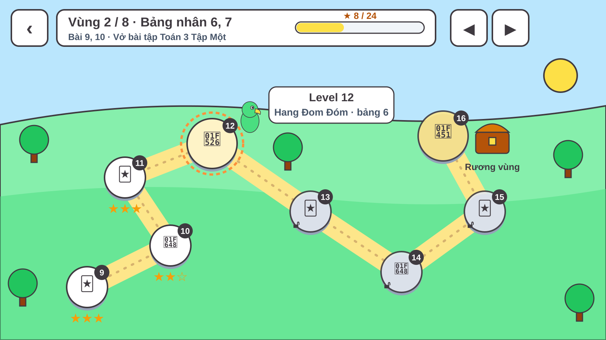

*Hình 6. Lớp 3, Vùng 2 (Bảng nhân 6, 7), màn ngang. Level 9–11 đã qua (có sao), Level 12 là level hiện tại (viền cam, vẹt đứng chờ, bong bóng ghi trạm + chủ đề). Level 13–15 chưa tới nhưng **vẫn bấm chơi được** (🔓). Level 16 👑 là level Trùm, cạnh đó là Rương vùng. Thanh trên: tên vùng, Bài trong sách, số sao của vùng, nút ◀ ▶ đổi vùng.*

### 5.1 Cấu trúc: lớp → vùng → level

```
Lớp 3
 ├─ Vùng 1  Bảng nhân, chia 2–5        (Bài 4, 5, 6)        Level 1–8
 ├─ Vùng 2  Bảng nhân, chia 6, 7        (Bài 9, 10)          Level 9–16
 ├─ Vùng 3  Bảng nhân, chia 8, 9        (Bài 11, 12)         Level 17–24
 ├─ ...
 └─ Vùng 8  Chu vi, diện tích, lịch, tiền (Bài 50, 52, 66, 68) Level 57–64
```

- **Vùng** = một nhóm Bài liền nhau trong sách (thường 1 chủ đề lớn). Mỗi vùng là một khung cảnh khác trên đảo: bãi cát, rừng dừa, suối, hang, đồi, làng chài, núi lửa, ngọn hải đăng.
- **Level** = một ván ở một trạm, với chủ đề và độ khó định sẵn.
- **Level Trùm 👑** cuối vùng = một chuyến 3 trạm liền, trộn mọi chủ đề của vùng + vài thẻ của vùng trước (để ôn lại).

### 5.2 Khuôn 8 level của một vùng

Mọi vùng dùng chung một khuôn, độ khó tăng dần theo **bậc** (B1 → B4, xem §5.3). Chủ đề A, B là hai chủ đề của vùng (ví dụ A = bảng 6, B = bảng 7).

| Level trong vùng | Trạm | Kiến thức | Bậc | Bé đang tập gì |
|---|---|---|---|---|
| 1 | 🃏 Bãi Lật Thẻ | A | B1 (nhìn trước) | Làm quen các cặp của A |
| 2 | 🙈 Khỉ Giấu Thẻ | A | B1 (nút cùng mặt) | Nhớ nhóm thẻ A |
| 3 | 🃏 Bãi Lật Thẻ | A + B | B2 (úp từ đầu) | Thêm B |
| 4 | 🔦 Hang Đom Đóm hoặc 🎵 Đàn Đá | A + B | B2 | Nhìn nhanh / quy luật của A, B |
| 5 | 🙈 Khỉ Giấu Thẻ | A + B | B3 (nút mặt kia) | Nhớ lại bằng kiến thức |
| 6 | 🃏 Bãi Lật Thẻ | A + B + vùng trước | B3 (trộn) | Trộn với kiến thức cũ |
| 7 | 🐢 Rùa hoặc 🃏 Bãi Lật Thẻ | A + B | B4 (thẻ bẫy / nhiều bước) | Phân biệt chỗ hay nhầm |
| 8 👑 | Trùm: 3 trạm liền | cả vùng + vùng trước | B3 | Tổng hợp |

- Level 4 chọn **Hang Đom Đóm** nếu chủ đề có hình (đồng hồ, khối, phân số, góc), chọn **Đàn Đá** nếu chủ đề có quy luật (bảng nhân, đếm thêm).
- Level 7 chọn **Rùa** nếu vùng là phép tính (cộng trừ, nhân chia, gấp giảm), còn lại là Bãi Lật Thẻ bậc B4.
- Vùng chỉ có 1 chủ đề thì B = chủ đề của vùng trước.
- **Lớp 1** dùng khuôn ngắn 5 level: Lật thẻ B1 → Khỉ B1 → Hang B1 → Lật thẻ B2 → 👑 Trùm (2 trạm). Không có Rùa, không có bậc B3, B4.

### 5.3 Bốn bậc độ khó (thông số từng trạm)

| Trạm | B1 | B2 | B3 | B4 |
|---|---|---|---|---|
| 🃏 Bãi Lật Thẻ | Ngửa trước 3 giây, ít cặp (lớp 1: 3; lớp 2–3: 4; lớp 4–5: 6) | Úp từ đầu, đủ cặp (4 / 6 / 8) | Trộn 2–3 chủ đề; lớp 3+ có bộ ba | Thêm 2 thẻ bẫy |
| 🙈 Khỉ Giấu Thẻ | 4 thẻ, nhìn 8 giây, nút cùng mặt | 6 thẻ, 6 giây, nút cùng mặt | 6 thẻ, 5 giây, nút mặt kia | Giấu 2 thẻ, hoặc 8 thẻ + đổi chỗ |
| 🔦 Hang Đom Đóm | Sáng 3 giây | 2,5 giây | 2 giây | 1,5 giây, nút sai là lỗi hay gặp |
| 🎵 Đàn Đá | Chuỗi tới 4 nốt, 8 phím | Tới 6 nốt, 12 phím | Tới 8 nốt | Có nốt câm (tự đoán) |
| 🐢 Rùa Nhớ Đường | 2 trạm, có 📝 nháp | 2 trạm | 3 trạm | 4 trạm |

Thông số nằm trong **một bảng dữ liệu**, không viết tay từng level. Một level = `{ vùng, thứ tự, trạm, chủ đề, bậc }`, app sinh ra từ khuôn ở §5.2.

### 5.4 Qua level, sao, Rương vùng

- **Qua level** = chơi xong ván (≥ 1 ⭐). Sao tính như §13.4 của từng trạm. Chơi lại để lấy thêm sao, giữ số sao cao nhất.
- **Level Trùm**: qua khi xong cả 3 trạm. Qua Trùm thì **mở Rương vùng**: một món trang trí cho đảo + thẻ của vùng được thêm vào Rương kho báu (§11) để ôn cách quãng sau đó.
- **Đủ 3 ⭐ mọi level trong vùng** (24 sao) → vùng được **cắm cờ vàng** trên bản đồ.
- Mỗi level xong là một lượt giải cho sticker, sao cộng vào bảng xếp hạng như các trò khác.

### 5.5 Mở level: không khóa cứng

Giữ nguyên tắc chung của các trò (không khóa trò, cấp nào):

- **Level hiện tại** = level đầu tiên chưa qua: viền cam, vẹt đứng chờ, nút to "▶ Đi tiếp" trên bản đồ đảo nhảy thẳng vào level này.
- **Level chưa tới** vẫn bấm được (biểu tượng 🔓). Bấm vào thì thẻ giới thiệu nói thêm: "Level này khó hơn level em đang chơi." kèm hai nút "▶ Vẫn chơi" và "↩ Về Level 12".
- **Vùng chưa tới** mở bằng ◀ ▶. Nếu tiến độ sách cho thấy bé **đã làm Bài** của vùng đó, vẹt gợi ý: "Em học tới Bài 31 rồi, nhảy tới Vùng 6!"

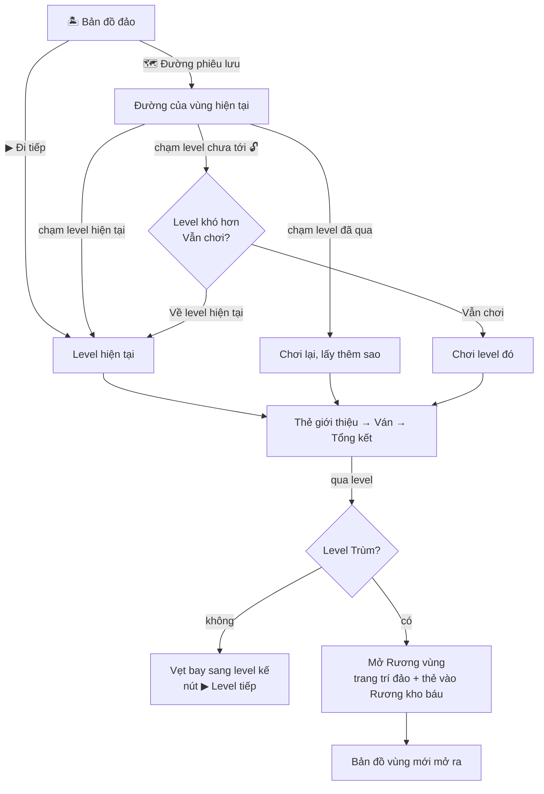
```mermaid
flowchart TD
    M[🏝️ Bản đồ đảo] -->|▶ Đi tiếp| L[Level hiện tại]
    M -->|🗺️ Đường phiêu lưu| P[Đường của vùng hiện tại]
    P -->|chạm level đã qua| L2[Chơi lại, lấy thêm sao]
    P -->|chạm level hiện tại| L
    P -->|chạm level chưa tới 🔓| W{Level khó hơn<br/>Vẫn chơi?}
    W -->|Vẫn chơi| L3[Chơi level đó]
    W -->|Về level hiện tại| L
    L & L2 & L3 --> G[Thẻ giới thiệu → Ván → Tổng kết]
    G -->|qua level| N{Level Trùm?}
    N -->|không| P2[Vẹt bay sang level kế<br/>nút ▶ Level tiếp]
    N -->|có| C[Mở Rương vùng<br/>trang trí đảo + thẻ vào Rương kho báu]
    C --> Z[Bản đồ vùng mới mở ra]
```

### 5.6 Tự điều chỉnh khi bé gặp khó

- **Thua cùng một level 2 lần** (chỉ được 1 ⭐ hoặc bỏ giữa chừng) → vẹt đề nghị "Chơi bản dễ hơn": cùng chủ đề, lùi một bậc. Qua bản dễ vẫn tính là qua level (1 ⭐), để bé không bị kẹt.
- **3 ⭐ liền 3 level** ở bậc thấp → thẻ giới thiệu gợi ý "Nhảy tới Level Trùm", bé chọn có hoặc không.

### 5.7 Danh sách vùng theo lớp

| Lớp | Vùng (Bài trong sách) | Số level |
|---|---|---|
| **1** | 1. Số 1–5 (6, 8) · 2. Số 6–10 và số 0 (16–21) · 3. Hình phẳng (3, 4) · 4. Cộng trong phạm vi 3, 4, 5 (25, 27, 29, 31) · 5. Trừ trong phạm vi 3 (34) | 5 × 5 = 25 |
| **2** | 1. Cộng qua 10 (7, 8) · 2. Trừ qua 10 (11, 12) · 3. Ki-lô-gam, lít (15, 16) · 4. Giờ, ngày, tháng (29, 30) · 5. Nhân, chia 2 và 5 (39, 40, 43, 44) · 6. Trăm, chục, đơn vị (48–52) · 7. dm, m, km và tiền (55, 56) | 7 × 8 = 56 |
| **3** | 1. Bảng nhân, chia 2–5 (4, 5, 6) · 2. Bảng 6, 7 (9, 10) · 3. Bảng 8, 9 (11, 12) · 4. Một phần mấy, hình (14, 17, 18, 19, 21) · 5. Gấp, giảm, hai bước tính (24, 27, 28) · 6. mm, g, ml, °C (30–33) · 7. Số đến 100 000, La Mã (45, 47, 59) · 8. Chu vi, diện tích, tháng năm, tiền (50, 52, 66, 68) | 8 × 8 = 64 |
| **4** | 1. Số nhiều chữ số (10, 11, 12) · 2. Góc (7, 8) · 3. Yến, tạ, tấn, diện tích (17, 18) · 4. Giây, thế kỉ (19) · 5. Vuông góc, song song, hình (27, 29, 31) · 6. Tính nhẩm số lớn (2, 22, 23) | 6 × 8 = 48 |
| **5** | 1. Phân số, hỗn số (3, 4, 7) · 2. Số thập phân (10, 11, 12) · 3. km², ha (15, 16) · 4. Nhân, chia với 10; 0,1 (23) · 5. Công thức diện tích (25, 26, 27) | 5 × 8 = 40 |

Khi app có thêm Tập 2 của lớp 1, 4, 5 thì thêm vùng nối tiếp.

### 5.8 Level, chơi tự do và Rương liên quan thế nào

| | 🗺️ Đường phiêu lưu | 🎲 Chơi tự do (§4) | 💎 Rương (§11) |
|---|---|---|---|
| Ai chọn kiến thức | App, theo thứ tự sách | Bé | App, theo ngày đến hạn |
| Mục tiêu | Qua màn, gom sao | Ôn đúng chỗ muốn ôn | Không quên thẻ đã học |
| Ghi vào Rương | Có | Có | Có |
| Thẻ mới vào Rương | Khi qua Trùm của vùng | Khi gặp lần đầu | |

Bản đồ đảo (Hình 1) thêm hai nút: **"▶ Đi tiếp · Level 12"** (to nhất, thay chỗ nút Chuyến đi) và **"🗺️ Đường phiêu lưu"**. Nút ⛵ Chuyến đi hôm nay chuyển xuống cạnh Rương.

---

## 6. Trạm 1: 🃏 Bãi Lật Thẻ

**Luyện:** nhớ vị trí + biết cặp nào bằng nhau. **Cảnh:** bãi cát, biển, dây phơi giữa hai cọc gỗ.

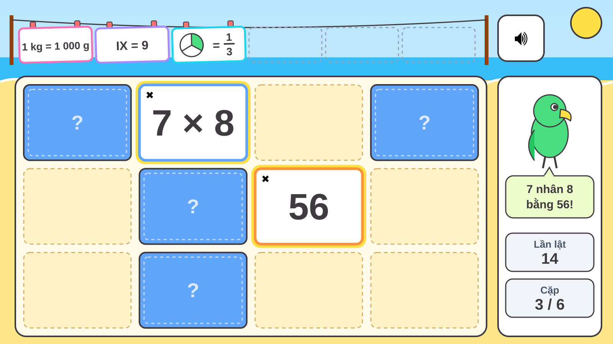

*Hình 2. Màn ngang, giữa ván, đang trộn 4 chủ đề lớp 3. Hai thẻ vừa lật là `7 × 8` và `56`; vẹt đọc "7 nhân 8 bằng 56!". Ba cặp trước đã bay lên dây phơi và **gộp thành một dải** `1 kg = 1 000 g`. Ô của cặp đã ghép để lại khung nét đứt, lưới không dồn lại.*

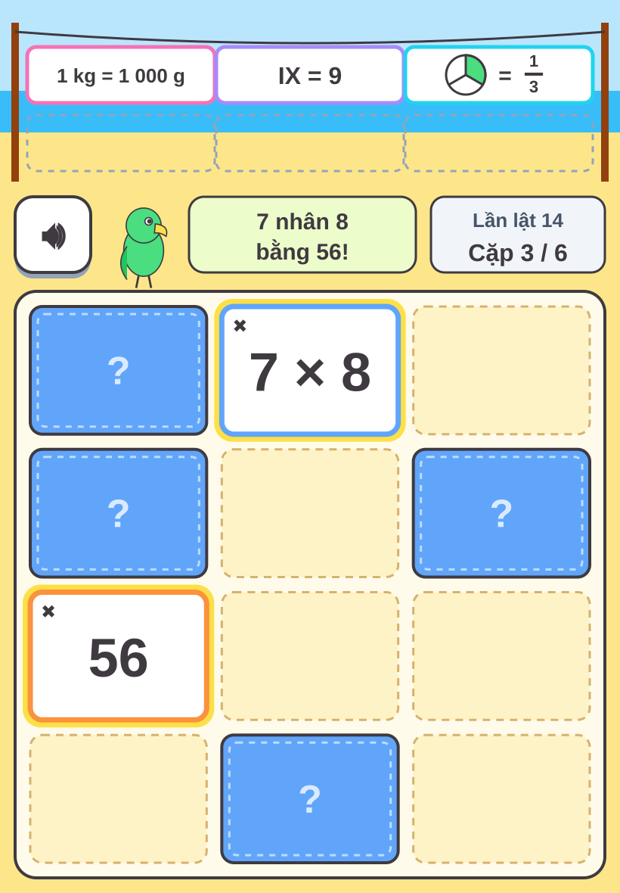

*Hình 3. Màn dọc: dây phơi 2 hàng ở trên, dải vẹt + lần lật, lưới 3 × 4 chiếm phần còn lại.*

### 6.1 Luật chơi

1. Bàn có N cặp thẻ úp (lớp 1: 3 rồi 4 cặp; lớp 2, 3: 6 cặp; lớp 4, 5: 8 cặp).
2. Bé chạm một thẻ: thẻ lật (hiệu ứng lật 3D), giọng đọc nội dung thẻ.
3. Bé chạm thẻ thứ hai:
   - **Bằng nhau** → vẹt đọc cả câu ("7 nhân 8 bằng 56!"), hai thẻ **bay** lên dây phơi và nhập thành một dải `7 × 8 = 56`, ô cũ thành khung nét đứt.
   - **Không bằng nhau** → hai thẻ rung nhẹ, giữ ngửa 1,2 giây (lớp 1: 2 giây) rồi úp lại. Không trừ điểm.
4. Hết thẻ → **Ôn nhanh 3 câu** (§6.3) → Tổng kết.

### 6.2 Trạng thái một lượt

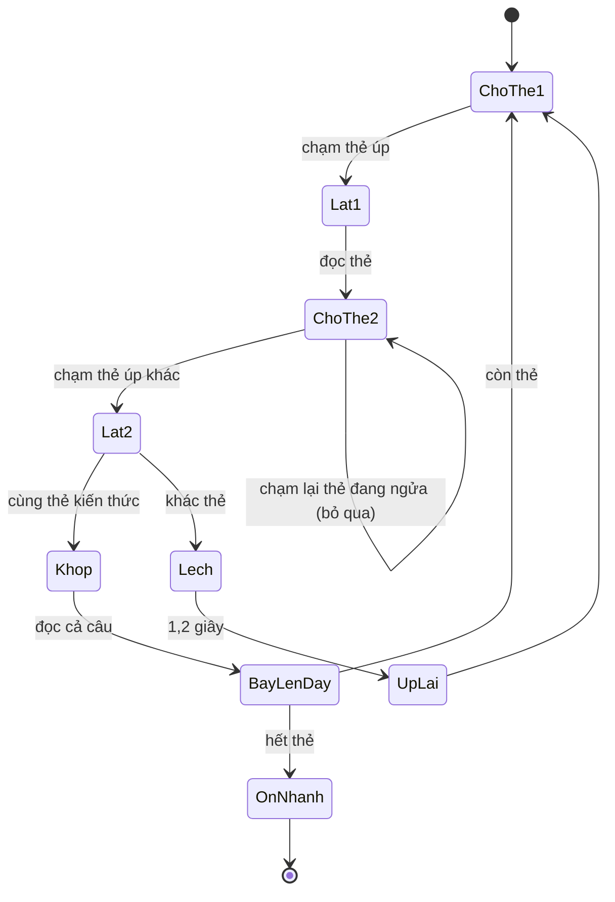
```mermaid
stateDiagram-v2
    [*] --> ChoThe1
    ChoThe1 --> Lat1: chạm thẻ úp
    Lat1 --> ChoThe2: đọc thẻ
    ChoThe2 --> Lat2: chạm thẻ úp khác
    ChoThe2 --> ChoThe2: chạm lại thẻ đang ngửa (bỏ qua)
    Lat2 --> Khop: cùng thẻ kiến thức
    Lat2 --> Lech: khác thẻ
    Khop --> BayLenDay: đọc cả câu
    BayLenDay --> ChoThe1: còn thẻ
    BayLenDay --> OnNhanh: hết thẻ
    Lech --> UpLai: 1,2 giây
    UpLai --> ChoThe1
    OnNhanh --> [*]
```

- Trong lúc bay / úp lại, bàn **không nhận chạm** (tránh bé bấm loạn).
- Bé ngồi yên 8 giây ở `ChoThe1`: vẹt nhắc "Lật một thẻ xanh!" và một thẻ xanh nhún nhẹ (quy tắc dẫn dắt sự chú ý).

### 6.3 Ôn nhanh cuối ván (để chắc bé nhớ kiến thức chứ không chỉ nhớ chỗ)

Bé có thể ghép đúng nhờ thử may. Vì vậy cuối ván, dây phơi lật úp **mặt đáp** của 3 dải, vẹt hỏi từng dải:

```
   ┌───────────────┐        ┌──────┐ ┌──────┐ ┌──────┐
   │  7 × 8 = ?    │        │  54  │ │  56  │ │  48  │      ← 3 nút to
   └───────────────┘        └──────┘ └──────┘ └──────┘
```

- Ba dải được chọn theo thứ tự: thẻ bé lật nhầm nhiều nhất, thẻ hạng thấp nhất, thẻ ngẫu nhiên.
- Nút sai lấy từ **danh sách nhầm hay gặp** của thẻ (`7 × 8` hay nhầm với 54, 48, 63).
- Đây là bước **duy nhất của Bãi Lật Thẻ được ghi vào Rương** (đúng → lên hạng, sai → xuống hạng). Lật nhầm trong ván không làm xuống hạng.

### 6.4 Cấp độ

Các cấp này chính là nguyên liệu của bậc B1–B4 trong level (§5.3).

| Cấp | Thay đổi | Gợi ý dùng cho |
|---|---|---|
| 1. Nhìn trước | Ngửa hết 3 giây đầu ván rồi úp | Lớp 1, lần đầu chơi chủ đề |
| 2. Úp từ đầu | Luật chuẩn | Mặc định |
| 3. Bộ ba | Mỗi nhóm có 3 thẻ (`1/2`, `2/4`, hình tô một nửa). Lật đủ 3 mới bay | Lớp 3+ phân số, lớp 5 phần trăm |
| 4. Thẻ bẫy | Có thêm 2 thẻ lẻ không có bạn, giá trị hay nhầm (`48` cạnh `7 × 8`) | Lớp 3+ bảng nhân |

### 6.5 Chơi hai người cùng máy

- Bé và bố mẹ thay phiên lật. Ai ghép được cặp thì **lật tiếp**.
- Dây phơi chia hai nửa, hai màu kẹp. Cuối ván so số dải.
- Không tính sao, không ghi Rương (để không làm sai tiến độ của bé).

### 6.6 Bố cục (ngang / dọc)

| Vùng | Ngang | Dọc | Giữ chỗ từ đầu |
|---|---|---|---|
| Dây phơi | Trên cùng, N ô nét đứt | Trên cùng, 2 hàng | ✓ đủ N ô |
| Vẹt + lời | Cột phải | Dải giữa | ✓ bong bóng có sẵn, chữ `&nbsp;` |
| Lần lật, cặp | Cột phải | Dải giữa | ✓ |
| Lưới thẻ | Phần còn lại, thẻ cỡ theo `cqmin` | Phần còn lại | ✓ ô ghép xong để khung nét đứt |
| Thẻ tổng kết | Phủ lên lưới (đã trống) | Phủ lên lưới | Không đẩy gì |

Số cột / hàng chọn **một lần** lúc bắt đầu ván theo hướng màn hình: 6 cặp = 4 × 3 (ngang) hoặc 3 × 4 (dọc); 8 cặp = 4 × 4; lớp 1 4 cặp = 4 × 2 hoặc 2 × 4.

---

## 7. Trạm 2: 🙈 Khỉ Giấu Thẻ

**Luyện:** nhớ một nhóm thẻ trong ít giây, rồi nhớ lại **bằng kiến thức**. **Cảnh:** rừng dừa, khỉ con tinh nghịch.

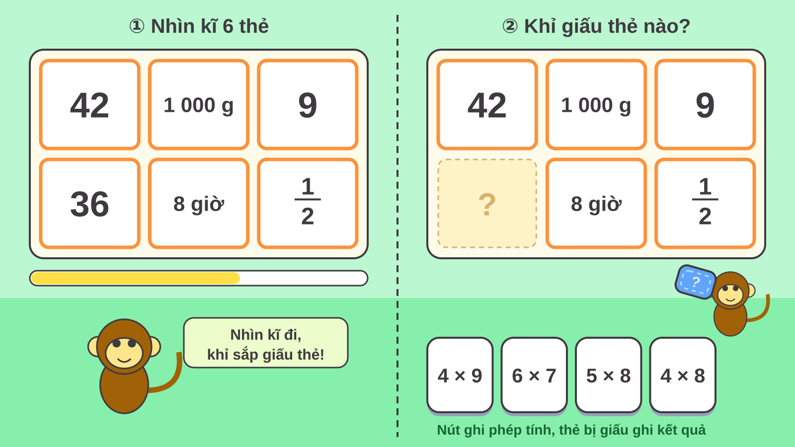

*Hình 4. Trái: bé nhìn 6 thẻ, thanh vàng là thời gian còn lại. Phải: khỉ đã giấu thẻ `36`; 4 nút ghi phép tính, bé chọn `4 × 9`.*

### 7.1 Flow một lượt

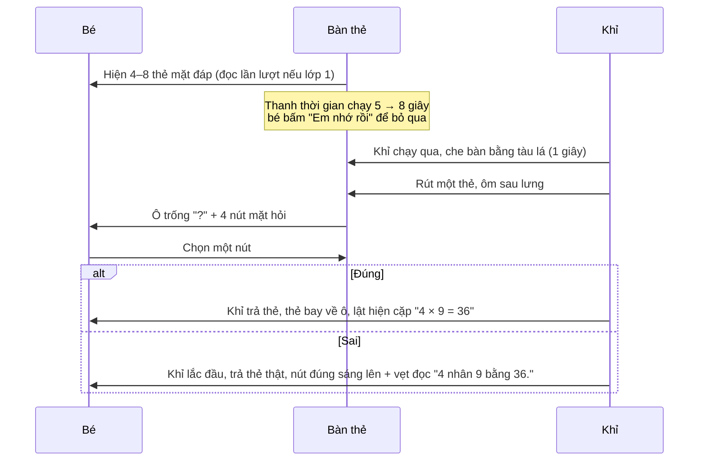
```mermaid
sequenceDiagram
    participant Be as Bé
    participant Ban as Bàn thẻ
    participant Khi as Khỉ
    Ban->>Be: Hiện 4–8 thẻ mặt đáp (đọc lần lượt nếu lớp 1)
    Note over Ban: Thanh thời gian chạy 5 → 8 giây<br/>bé bấm "Em nhớ rồi" để bỏ qua
    Khi->>Ban: Khỉ chạy qua, che bàn bằng tàu lá (1 giây)
    Khi->>Ban: Rút một thẻ, ôm sau lưng
    Ban->>Be: Ô trống "?" + 4 nút mặt hỏi
    Be->>Ban: Chọn một nút
    alt Đúng
        Khi->>Be: Khỉ trả thẻ, thẻ bay về ô, lật hiện cặp "4 × 9 = 36"
    else Sai
        Khi->>Be: Khỉ lắc đầu, trả thẻ thật, nút đúng sáng lên + vẹt đọc "4 nhân 9 bằng 36."
    end
```

### 7.2 Vì sao nút ghi **mặt kia**

Thẻ bị giấu là `36`, nhưng nút ghi `4 × 9`, `6 × 7`, `5 × 8`, `4 × 8`. Bé phải (1) nhớ trên bàn đã có `36` và (2) biết `4 × 9 = 36`. Ba nút sai là **mặt hỏi của các thẻ vẫn còn trên bàn** hoặc phép tính hay nhầm, nên bé không đoán được bằng loại trừ.

### 7.3 Cấp độ

| Cấp | Số thẻ | Thời gian nhìn | Ghi chú |
|---|---|---|---|
| 1 | 4 | 8 giây | Nút ghi **cùng mặt** (`36`), chỉ luyện nhớ. Lớp 1 dùng cấp này |
| 2 | 6 | 6 giây | Nút ghi mặt kia |
| 3 | 6 | 5 giây | Khỉ giấu **2 thẻ**, chọn 2 nút |
| 4 | 8 | 5 giây | Khỉ **đổi chỗ** các thẻ còn lại khi giấu |

Một ván = 5 lượt. Mỗi lượt đúng / sai ghi vào Rương.

---

## 8. Trạm 3: 🔦 Hang Đom Đóm

**Luyện:** nhìn chớp nhoáng rồi nhớ (đọc nhanh hình, không đếm từng cái). **Cảnh:** hang tối, đom đóm bay.

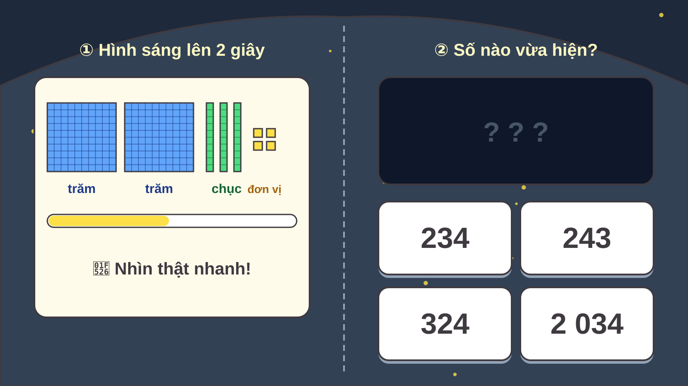

*Hình 5. Trái: đèn soi bảng 2 giây (2 khối trăm, 3 thanh chục, 4 khối đơn vị). Phải: tối lại, bé chọn trong 4 nút to. Nút sai là các lỗi hay gặp: đảo chục và đơn vị, viết thêm số 0.*

### 8.1 Flow

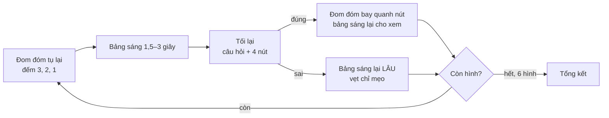
```mermaid
flowchart LR
    A[Đom đóm tụ lại<br/>đếm 3, 2, 1] --> B[Bảng sáng 1,5–3 giây]
    B --> C[Tối lại<br/>câu hỏi + 4 nút]
    C -->|đúng| D[Đom đóm bay quanh nút<br/>bảng sáng lại cho xem]
    C -->|sai| E[Bảng sáng lại LÂU<br/>vẹt chỉ mẹo]
    D --> F{Còn hình?}
    E --> F
    F -->|còn| A
    F -->|hết, 6 hình| G[Tổng kết]
```

### 8.2 Nội dung theo lớp

| Lớp | Hình sáng lên | Câu hỏi | Mẹo khi sai |
|---|---|---|---|
| 1 | Chấm trên khung 10 ô (1–10) | Có mấy chấm? | "Khung 10 ô thiếu 2 ô là 8." |
| 1 | Một nhóm hình (vuông, tròn, tam giác) | Có mấy hình tam giác? | Hình bay ra, tô viền |
| 2 | Khối trăm, chục, đơn vị | Số nào? | Đếm theo từng loại khối |
| 2 | Đồng hồ kim | Mấy giờ? | Kim ngắn chỉ giờ |
| 2 | Hai tờ tiền | Tất cả bao nhiêu đồng? | |
| 3 | Hình tô phần | Đã tô một phần mấy? | Đếm số phần bằng nhau |
| 3 | Nhiệt kế | Bao nhiêu độ C? | |
| 4 | Số có 6–9 chữ số, một chữ số tô đỏ | Chữ số đỏ có giá trị bao nhiêu? | Tô màu theo lớp đơn vị / nghìn / triệu |
| 4 | Góc | Góc nhọn, tù, vuông hay bẹt? | Đặt ê ke lên |
| 5 | Số thập phân trên tia số | Số nào? | |
| 5 | Hình có kích thước | Diện tích bao nhiêu? | Hiện công thức |

### 8.3 Cấp độ

Thời gian sáng giảm dần: **3 giây → 2 giây → 1,5 giây**. Bé đúng 3 hình liền thì tự giảm, sai 2 hình liền thì tự tăng lại. Máy tắt hiệu ứng: đèn bật / tắt bằng mờ dần, thời gian không đổi.

---

## 9. Trạm 4: 🎵 Đàn Đá

**Luyện:** nhớ chuỗi, và học rằng **hiểu quy luật thì nhớ dễ hơn**. **Cảnh:** bãi đá ven suối, mỗi hòn đá là một phím đàn có số.

```
            ☁️                 🐦  (chim nhảy lên phím)
   ┌────┐ ┌────┐ ┌────┐ ┌────┐ ┌────┐ ┌────┐
   │  3 │ │  6 │ │  8 │ │  9 │ │ 12 │ │ 14 │      ← 12 hòn đá, số tăng dần
   └────┘ └────┘ └────┘ └────┘ └────┘ └────┘         có cả số "bẫy" (8, 14…)
   ┌────┐ ┌────┐ ┌────┐ ┌────┐ ┌────┐ ┌────┐
   │ 15 │ │ 16 │ │ 18 │ │ 20 │ │ 21 │ │ 24 │
   └────┘ └────┘ └────┘ └────┘ └────┘ └────┘
   ─────────────────────────────────────────
     ●  ●  ●  ○  ○        Chuỗi: 3 → 6 → 9 ...    ← dải tiến độ, giữ chỗ 8 nốt
```

### 9.1 Flow

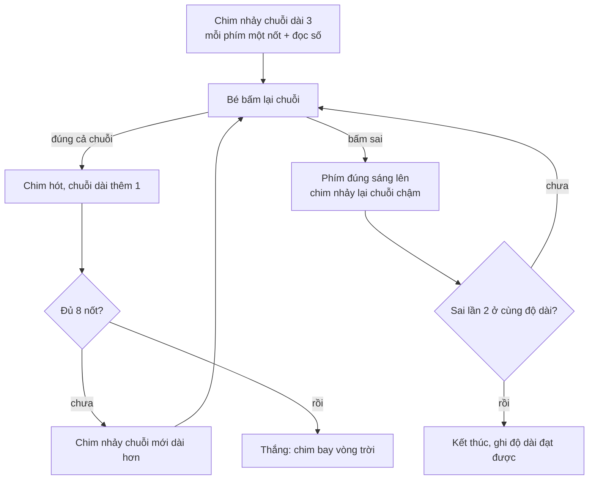
```mermaid
flowchart TD
    A[Chim nhảy chuỗi dài 3<br/>mỗi phím một nốt + đọc số] --> B[Bé bấm lại chuỗi]
    B -->|đúng cả chuỗi| C[Chim hót, chuỗi dài thêm 1]
    C --> D{Đủ 8 nốt?}
    D -->|chưa| A2[Chim nhảy chuỗi mới dài hơn] --> B
    D -->|rồi| W[Thắng: chim bay vòng trời]
    B -->|bấm sai| E[Phím đúng sáng lên<br/>chim nhảy lại chuỗi chậm]
    E --> F{Sai lần 2 ở cùng độ dài?}
    F -->|chưa| B
    F -->|rồi| G[Kết thúc, ghi độ dài đạt được]
```

### 9.2 Quy luật theo lớp

| Lớp | Chuỗi | Bài |
|---|---|---|
| 1 | Đếm thêm 1, đếm thêm 2, đếm lùi 1 (trong 10) | Bài 6–22 |
| 2 | Đếm thêm 2, 5, 10; bảng nhân 2, 5; tròn chục, tròn trăm | Bài 39, 40, 49 |
| 3 | Bảng nhân 3–9 | Bài 5, 6, 9–12 |
| 4 | Số chẵn, số lẻ; đếm thêm 1 000, 10 000 | Bài 3, 15 |
| 5 | Đếm thêm 0,1; 0,5; 0,25 | Bài 10, 11 |

### 9.3 Cấp cao: "Nốt câm"

Sau 4 nốt, nốt thứ 5 **không phát**: chim đứng chờ trên không. Bé phải tự đoán số tiếp theo theo quy luật. Đúng thì chim hạ xuống phím đó.

---

## 10. Trạm 5: 🐢 Rùa Nhớ Đường

**Luyện:** nhớ đường đi + **tính nhẩm từng bước trong đầu** (trí nhớ làm việc). **Cảnh:** vườn có lối đá, tổ rùa ở góc.

```
  Bước 1: xem đường (3–4 giây)          Bước 3: rùa về tổ mang số mấy?
  ┌─────┬─────┬─────┬─────┐             ┌──────────────────────────┐
  │🐢 12│ + 5 │ − 3 │ × 2 │             │   12 + 5 = 17            │ ← hiện SAU khi trả lời,
  ├─────┼──👣─┼─────┼─────┤             │   17 × 2 = 34            │   từng dòng như sách
  │ − 4 │ × 2 │ + 8 │ : 2 │             │   34 − 4 = 30            │
  ├─────┼──👣─┼─────┼─────┤             └──────────────────────────┘
  │ + 6 │ − 4 │👣🏠 │ + 1 │             ┌───┬───┬───┐
  └─────┴─────┴─────┴─────┘             │ 7 │ 8 │ 9 │   bàn phím số
                                        ├───┼───┼───┤   có sẵn từ đầu lượt
  Bước 2: dấu chân mờ đi,               │ 4 │ 5 │ 6 │   (quy tắc không relayout)
  bé chạm lại từng ô cho rùa đi         ├───┼───┼───┤
                                        │ 1 │ 2 │ 3 │
                                        ├───┼───┼───┤
                                        │ ⌫ │ 0 │ ✓ │
                                        └───┴───┴───┘
```

### 10.1 Flow

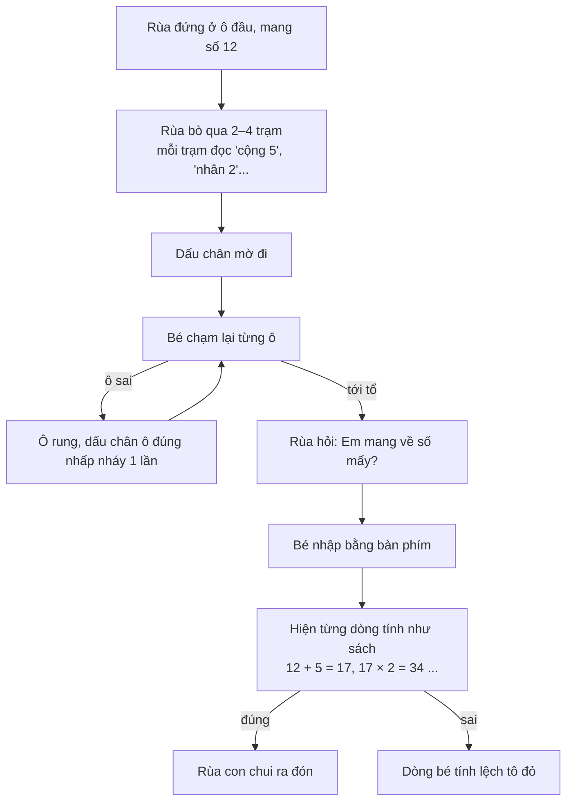
```mermaid
flowchart TD
    A[Rùa đứng ở ô đầu, mang số 12] --> B[Rùa bò qua 2–4 trạm<br/>mỗi trạm đọc 'cộng 5', 'nhân 2'...]
    B --> C[Dấu chân mờ đi]
    C --> D[Bé chạm lại từng ô]
    D -->|ô sai| E[Ô rung, dấu chân ô đúng nhấp nháy 1 lần]
    E --> D
    D -->|tới tổ| F[Rùa hỏi: Em mang về số mấy?]
    F --> G[Bé nhập bằng bàn phím]
    G --> H[Hiện từng dòng tính như sách<br/>12 + 5 = 17, 17 × 2 = 34 ...]
    H -->|đúng| I[Rùa con chui ra đón]
    H -->|sai| J[Dòng bé tính lệch tô đỏ]
```

- Số **không hiện** trong lúc rùa đi, bé phải giữ trong đầu. Lớp 2 và lớp 3 cấp đầu có tuỳ chọn "📝 nháp" hiện số sau mỗi trạm.
- Lời giải hiện **từng dòng** như sách (`createExprSteps`), không nhảy thẳng tới kết quả.

### 10.2 Cấp theo lớp

| Lớp | Số trạm | Phép tính | Phạm vi |
|---|---|---|---|
| 2 | 2 | +, − (qua 10, có nhớ) | 100 |
| 3 | 3 | +, −, ×, : (bảng 2–9) | 1 000 |
| 4 | 3–4 | thêm nhân chia số tròn chục, tròn trăm | 100 000 |
| 5 | 3–4 | thêm × 10, : 10, × 0,1 với số thập phân | số thập phân 2 chữ số |

---

## 11. 💎 Rương kho báu: ôn cách quãng nhiều ngày

Rương là **trí nhớ dài hạn** của trò chơi: mỗi thẻ kiến thức là một viên đá quý, lên hạng khi bé nhớ đúng, và **quay lại** đúng lúc bé sắp quên.

### 11.1 Năm hạng

| Hạng | Hình | Ôn lại sau | Lên hạng khi |
|---|---|---|---|
| 1 | 🪨 Đá thô | 1 ngày | Trả lời đúng |
| 2 | 🥉 Đồng | 2 ngày | Trả lời đúng |
| 3 | 🥈 Bạc | 4 ngày | Trả lời đúng |
| 4 | 🥇 Vàng | 7 ngày | Trả lời đúng |
| 5 | 💎 Kim cương | 21 ngày (giữ nhớ) | |

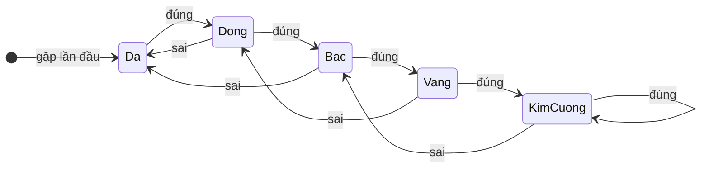
```mermaid
stateDiagram-v2
    direction LR
    [*] --> Da: gặp lần đầu
    Da --> Dong: đúng
    Dong --> Bac: đúng
    Bac --> Vang: đúng
    Vang --> KimCuong: đúng
    KimCuong --> KimCuong: đúng
    Dong --> Da: sai
    Bac --> Da: sai
    Vang --> Dong: sai
    KimCuong --> Bac: sai
```

- **Sai thì lùi 2 hạng** (không về số 0 ngay), để bé không nản. Viên đá không mất, chỉ "cần đánh bóng lại" (đá mờ đi).
- **Mỗi thẻ lên tối đa 1 hạng mỗi ngày**, tránh học dồn trong một buổi.
- **Câu trả lời được ghi:** Ôn nhanh cuối Bãi Lật Thẻ, mỗi lượt Khỉ Giấu Thẻ, mỗi hình Hang Đom Đóm có gắn thẻ, và màn Ôn rương (§11.2). Đàn Đá và Rùa Nhớ Đường không ghi (luyện quy luật, tính nhẩm, không phải một thẻ cụ thể).

### 11.2 Màn Rương

```
┌──────────────────────────────────────────────────────────────────────┐
│ ‹  💎 Rương kho báu · Lớp 3                    🔔 8 thẻ chờ ôn hôm nay │
├──────────────────────────────────────────────────────────────────────┤
│  ✖️ Bảng nhân 7     🪨🪨🥉🥉🥈🥈🥇🥇💎💎                    [ Ôn ]          │
│  ✖️ Bảng nhân 8     🪨🪨🪨🥉🥉🥈░░░░  (4 thẻ chưa gặp)       [ Ôn ]          │
│  ⚖️ g, kg           💎💎💎🥇                               [ Ôn ]          │
│  🏛️ Số La Mã        🥉🥉🪨░░░░░░░░                         [ Ôn ]          │
│  ...                                                                 │
├──────────────────────────────────────────────────────────────────────┤
│        [   🔔 Ôn 8 thẻ chờ (khoảng 2 phút)   ]                         │
└──────────────────────────────────────────────────────────────────────┘
```

- Mỗi dòng là một chủ đề, mỗi ô là một thẻ (vẽ đúng viên đá của hạng). Chạm một viên đá thì lật xem thẻ đó.
- **Ôn thẻ chờ**: hỏi nhanh từng thẻ đến hạn, 3–4 nút to (giống Ôn nhanh §6.3). Mỗi câu đúng, viên đá **bay vào rương** và sáng lên hạng mới.
- Phụ huynh: nút nhỏ "👪 Xem cho phụ huynh" hiện bảng "Con đã thuộc: bảng 2, 3, 5 (💎). Đang học: bảng 7, 8. Hay nhầm: 7 × 6, 8 × 7".

### 11.3 Nhắc ôn

- Thẻ **🏝️ Đảo Trí Nhớ** trên trang chủ có chấm đỏ 🔔 và số thẻ chờ khi có thẻ đến hạn.
- Không gửi thông báo đẩy, không đếm ngày liên tiếp kiểu "mất chuỗi", để bé không bị áp lực.

---

## 12. Bộ thẻ theo lớp

Mỗi bộ thẻ là một chủ đề, gắn với Bài trong sách (mã `bai-xx` như catalog trò chơi lớp 2, 3). Số liệu sinh ra phải đúng phạm vi Bài đó.

### Lớp 1 (Vở BT Toán 1 Tập 1, `grade1-workbook`)

| Chủ đề | Bài | Mặt hỏi ↔ mặt đáp |
|---|---|---|
| 🔢 Các số 0–10 | 6, 8, 16–21 | chấm / khung 10 ô / ngón tay ↔ chữ số |
| 🔷 Hình phẳng | 3, 4 | hình vuông, hình tròn, hình tam giác ↔ đồ vật có hình đó (khăn tay, đồng hồ, biển báo) |
| ➕ Cộng trong phạm vi 3, 4, 5 | 25, 27, 29 | `2 + 3` (kèm chấm) ↔ `5` |
| ➕ Số 0 trong phép cộng | 31 | `4 + 0` ↔ `4` |
| ➖ Trừ trong phạm vi 3 | 34 | `3 − 1` ↔ `2` |
| 🔟 Gộp và tách (cấp sau) | 25–34 | `5` ↔ `2 và 3` |

Lớp 1: mọi mặt thẻ có hình hoặc số, **không có thẻ chữ dài**. Mỗi thẻ lật lên đều được đọc to.

### Lớp 2 (`grade2-workbook`, `grade2-workbook-2`)

| Chủ đề | Bài | Ví dụ |
|---|---|---|
| ➕ Bảng cộng qua 10 | 7, 8 | `8 + 5` ↔ `13` |
| ➖ Bảng trừ qua 10 | 11, 12 | `13 − 5` ↔ `8` |
| ⚖️ Ki-lô-gam, 💧 lít | 15, 16 | cân có quả cân 2 kg + 1 kg ↔ `3 kg` |
| 🕐 Giờ, phút | 29 | đồng hồ kim ↔ `8 giờ 30 phút` |
| 📅 Ngày, tháng | 30 | `tháng 4` ↔ `30 ngày` |
| ✖️ Bảng nhân 2, 5 | 39, 40 | `5 × 4` ↔ `20` |
| ➗ Bảng chia 2, 5 | 43, 44 | `10 : 2` ↔ `5` |
| 🔷 Khối trụ, khối cầu | 46 | hình khối ↔ tên |
| 💯 Trăm, chục, đơn vị | 48–52 | khối ↔ `234`; `305` ↔ "ba trăm linh năm" |
| 📏 dm, m, km | 55 | `1 m` ↔ `10 dm` |
| 💵 Tiền Việt Nam | 56 | tờ 200 đồng + tờ 500 đồng ↔ `700 đồng` |

### Lớp 3 (`grade3-workbook`, `grade3-workbook-2`)

| Chủ đề | Bài | Ví dụ |
|---|---|---|
| ✖️➗ Bảng nhân, chia 2–9 | 4, 5, 6, 9, 10, 11, 12 | `7 × 8` ↔ `56`, `56 : 8` ↔ `7` |
| 🍰 Một phần mấy | 14 | hình tô 1/3 ↔ `1/3` (bộ ba: hình, phân số, "một phần ba") |
| ⭕ Hình tròn | 17 | hình tô bán kính ↔ "bán kính" |
| 📐 Góc vuông, hình | 18, 19, 21 | góc ↔ "góc vuông"; khối ↔ "khối lập phương" |
| ✖️ Gấp, giảm một số lần | 24, 27 | `gấp 4 lên 3 lần` ↔ `12` |
| 📏 mm, ⚖️ g, 💧 ml | 30, 31, 32 | `1 cm` ↔ `10 mm`, `1 kg` ↔ `1 000 g`, `1 l` ↔ `1 000 ml` |
| 🌡️ Nhiệt độ | 33 | nhiệt kế ↔ `25 °C` |
| 🔢 Số 4, 5 chữ số | 45, 59 | `7 052` ↔ "bảy nghìn không trăm năm mươi hai" |
| 🏛️ Số La Mã | 47 | `IX` ↔ `9`, `XII` ↔ `12` |
| 📐 Chu vi, diện tích | 50, 52 | hình chữ nhật ↔ `(a + b) × 2`; hình vuông ↔ `a × a` |
| 🗓️ Tháng, năm | 66 | `tháng 2` ↔ `28 hoặc 29 ngày` |
| 💵 Tiền Việt Nam | 68 | tờ tiền ↔ mệnh giá |

### Lớp 4 (`grade4-tools`, Tập 1)

| Chủ đề | Bài | Ví dụ |
|---|---|---|
| 🔢 Số nhiều chữ số ↔ cách đọc | 10, 12 | `2 050 300` ↔ "hai triệu không trăm năm mươi nghìn ba trăm" |
| 🧱 Giá trị chữ số theo hàng, lớp | 11 | `3̲45 678` (tô đỏ) ↔ `300 000` |
| 📐 Góc nhọn, tù, bẹt; số đo góc | 7, 8 | hình góc ↔ "góc tù"; góc bẹt ↔ `180°` |
| ⚖️ Yến, tạ, tấn | 17 | `1 tấn` ↔ `10 tạ` ↔ `1 000 kg` (bộ ba) |
| 🔲 dm², m², mm² | 18 | `1 m²` ↔ `100 dm²` |
| ⏱️ Giây, thế kỉ | 19 | `1 phút` ↔ `60 giây`; năm `2026` ↔ "thế kỉ XXI" |
| 📐 Vuông góc, song song, hình bình hành, hình thoi | 27, 29, 31 | hình ↔ tên |

Khi có Toán 4 Tập 2 trong app: thêm phân số bằng nhau, rút gọn phân số.

### Lớp 5 (`grade5-tools`, Tập 1)

| Chủ đề | Bài | Ví dụ |
|---|---|---|
| 🍰 Phân số bằng nhau | 3 | `2/3` ↔ `4/6` |
| 🔟 Phân số thập phân | 4 | `3/5` ↔ `6/10` |
| 🍰 Hỗn số | 7 | `2 1/4` ↔ `9/4` ↔ hình (bộ ba) |
| 🔢 Số thập phân | 10 | `0,25` ↔ `25/100` |
| 📏 Số đo dạng số thập phân | 12 | `1 m 25 cm` ↔ `1,25 m` |
| 🔲 km², ha | 15, 16 | `1 ha` ↔ `10 000 m²` |
| ✖️ Nhân, chia với 10; 0,1… | 23 | `3,45 × 10` ↔ `34,5` |
| 📐 Công thức diện tích | 25, 26, 27 | tam giác ↔ `a × h : 2`; hình thang ↔ `(a + b) × h : 2`; hình tròn ↔ `r × r × 3,14` |

Khi có Toán 5 Tập 2: thêm tỉ số phần trăm (bộ ba `1/4`, `0,25`, `25 %`), thể tích.

### Danh sách nhầm hay gặp (cho nút sai và thẻ bẫy)

Mỗi bộ thẻ khai báo hàm `confusers(fact)`:

- Bảng nhân: kết quả của thừa số lân cận (`7 × 8` → 48, 63, 54).
- Đổi đơn vị: lệch một số 0 (`1 kg` → 100 g, 10 000 g).
- Đọc số: thiếu "không trăm", "linh" (`305` → "ba trăm năm").
- Đồng hồ: đổi kim giờ, kim phút (`8:30` → 6 giờ 40 phút).
- Trăm chục đơn vị: đảo hàng (`234` → 243, 324, 2 034).

---

## 13. Hướng dẫn, giọng đọc, chuyển động, phần thưởng

### 13.1 Nhân vật dẫn

- **🦜 Vẹt** dẫn đường cả đảo: đọc thẻ, nhắc khi bé ngồi yên, chỉ mẹo khi sai.
- Mỗi trạm có thêm nhân vật riêng (khỉ, chim, rùa, đom đóm), có 3 biểu cảm: chờ, vui, suy nghĩ.
- Lời thoại ngắn, kết bằng "!" hoặc ".", **không dùng "nhé"**, không dùng dấu "—".

| Lúc | Lời vẹt (ví dụ) |
|---|---|
| Bắt đầu Bãi Lật Thẻ | "Lật hai thẻ bằng nhau!" |
| Ghép đúng | "7 nhân 8 bằng 56!" |
| Ngồi yên 8 giây | "Lật một thẻ xanh!" (thẻ xanh nhún) |
| Lật nhầm 3 lần cùng một thẻ | "Thẻ 56 ở hàng giữa đó." (thẻ đó loé sáng 0,5 giây) |
| Khỉ chuẩn bị giấu | "Nhìn kĩ đi, khỉ sắp giấu thẻ!" |
| Sai ở Hang Đom Đóm | "Khung 10 ô thiếu 2 ô là 8." |

### 13.2 Chuyển động (mọi thao tác đều có)

| Hành động | Chuyển động | Máy tắt hiệu ứng |
|---|---|---|
| Lật thẻ | Lật 3D quanh trục dọc 0,3 giây | Mờ dần đổi mặt |
| Ghép đúng | Hai thẻ bay (`flyOne`) lên dây phơi, nhập thành một dải, kẹp nảy | Bay chậm, không nảy |
| Lật nhầm | Rung nhẹ, úp lại | Viền đỏ 1 giây, úp lại |
| Khỉ giấu thẻ | Khỉ chạy ngang, tàu lá che, thẻ bay vào tay khỉ | Tàu lá mờ dần |
| Đá quý lên hạng | Viên đá bay vào rương, sáng lấp lánh | Bay chậm, đổi màu |
| Thuyền sang trạm | Thuyền lướt sóng 2 giây | Trượt êm 2 giây |

Không bỏ chuyển động dạy học khi máy tắt hiệu ứng, chỉ chạy bản êm (quy tắc reduced motion).

### 13.3 Âm thanh

- Giọng đọc TTS + fallback của phần Tiền tiểu học, có nút 🔊 đọc lại.
- Đàn Đá: mỗi phím một nốt (Web Audio, gam ngũ cung để chuỗi nào nghe cũng hay).
- Tiếng lật thẻ, tiếng ting khi ghép, dùng lại `fx.js`.

### 13.4 Phần thưởng

| Trạm | ⭐⭐⭐ | ⭐⭐ | ⭐ |
|---|---|---|---|
| Bãi Lật Thẻ (N cặp) | ≤ 3N lần lật | ≤ 4,5N | xong ván |
| Khỉ Giấu Thẻ (5 lượt) | 5 đúng | 3–4 | xong ván |
| Hang Đom Đóm (6 hình) | 6 đúng | 4–5 | xong ván |
| Đàn Đá | nhớ được 8 nốt | 6–7 | xong ván |
| Rùa Nhớ Đường (4 đường) | 4 đúng | 2–3 | xong ván |

- Sao cộng vào hệ sao chung (bảng xếp hạng tự tính). Mỗi trạm × lớp một dòng trong `src/data/starRatings.js`, prefix `memory`.
- Mỗi ván xong = một lượt giải cho vòng quay sticker (lớp 2+: 10 lượt = 1 lần quay; lớp 1 theo quy tắc lớp 1 hiện có).
- Kỷ lục mỗi trạm × túi thẻ (ít lần lật nhất, chuỗi dài nhất).
- Đảo thêm đồ trang trí sau mỗi Chuyến đi hôm nay (§4.3).

---

## 14. Kỹ thuật và lộ trình

### 14.1 Tệp

```
src/games/memoryIsland.js          ← vào game: bản đồ, túi thẻ, thẻ giới thiệu, tổng kết, chuyến đi
src/games/memoryIsland/
  facts/                           ← kho thẻ theo lớp
    index.js                       ← registry: topicsFor(grade), factsFor(topicIds)
    g1.js g2.js g3.js g4.js g5.js
  faces.js                         ← vẽ mặt thẻ (số, chữ + TTS, chấm, khối, đồng hồ, tiền, phân số, hình)
  pick.js                          ← bốc thẻ (§4.2), kiểm tra trùng khoá (§2.3)
  chest.js                         ← Rương: hạng, ngày đến hạn, ghi đúng/sai, màn Rương
  stations/
    flip.js                        ← 🃏 Bãi Lật Thẻ
    monkey.js                      ← 🙈 Khỉ Giấu Thẻ
    cave.js                        ← 🔦 Hang Đom Đóm
    stones.js                      ← 🎵 Đàn Đá
    turtle.js                      ← 🐢 Rùa Nhớ Đường
  art/                             ← cảnh nền SVG: biển, bãi cát, rừng dừa, hang, suối, vườn; vẹt, khỉ, rùa, chim
  styles.js
```

### 14.2 Khai báo một chủ đề

```js
// facts/g3.js
export const topics = [
  {
    id: 'g3-mul7', icon: '✖️', title: 'Bảng nhân 7', group: 'phep-tinh',
    lessons: { 'grade3-workbook': ['bai-10'] },
    knowledge: 'bảng nhân 7, bảng chia 7',
    facts: () => range(1, 10).map((n) => ({
      id: `7x${n}`,
      faces: [
        { role: 'ask', kind: 'expr', text: `7 × ${n}`, say: `7 nhân ${n}` },
        { role: 'ans', kind: 'num', text: String(7 * n), key: String(7 * n) },
      ],
      sentence: `7 nhân ${n} bằng ${7 * n}`,
      confusers: () => [7 * (n - 1), 7 * (n + 1), 6 * n].filter((v) => v > 0),
    })),
  },
  // ...
];
```

- Mỗi thẻ có `id` cố định để Rương nhớ qua nhiều ngày; số liệu không ngẫu nhiên trong một thẻ, chỉ **việc chọn thẻ** là ngẫu nhiên.
- Trạm Hang Đom Đóm, Đàn Đá, Rùa có thêm bộ sinh riêng (`flashItems`, `sequences`, `paths`) nhưng dùng chung `lessons`.

### 14.3 Lưu dữ liệu

```js
// scopedKey('memory-v1') → đồng bộ Drive qua tth:data-changed
{
  chest: { 'g3:7x8': { box: 3, due: '2026-10-10', last: '2026-10-06', wrong: 2 } },
  records: { 'flip:g3-mul7': { flips: 16 }, 'stones:g3': { len: 7 } },
  island: { decor: ['flag', 'lighthouse'], lastTrip: '2026-10-06' },
}
```

- Máy tự động (`navigator.webdriver`) không ghi Firebase (quy tắc không tạo khách thử trên prod).
- Tiếng Anh: thẻ số, phép tính dịch qua `engine/i18n.js`; thẻ "cách đọc số" cần bản đọc tiếng Anh riêng (dùng lại bộ đọc số EN nếu có), từ điển riêng của trò.

### 14.4 Phát hành và kiểm tra

- Cờ `MEMORY_ISLAND = import.meta.env.DEV` trong `src/data/features.js`, code nạp bằng `import()` động, chỉ bật production khi chốt.
- Trang dev `scripts/games-preview.html?mod=memoryIsland/stations/flip.js&...` với seed cố định.
- Mỗi trạm chụp màn **ngang + dọc**, **đầu / giữa / cuối lượt** theo checklist của `game-screen-layout` trước khi báo xong.

### 14.5 Lộ trình

| Giai đoạn | Nội dung | Kết quả |
|---|---|---|
| 0 | Duyệt mockup trong tài liệu này; vẽ cảnh bãi cát + vẹt thật bằng SVG | Chốt phong cách |
| 1 | `facts` lớp 3 (bảng nhân chia, đơn vị, La Mã) + `pick.js` + 🃏 Bãi Lật Thẻ + Ôn nhanh + tổng kết | Chơi trọn một trạm, ôn một chủ đề và trộn |
| 1b | Thẻ 🏝️ trên trang chủ mỗi lớp + 🏫 **Chơi cả lớp**: màn chuẩn bị, đội, bảng điểm, toàn màn hình, phím tắt, Bãi Lật Thẻ có toạ độ; nút "🏫 Chiếu cho cả lớp" trong menu Bài | Giáo viên dùng được trên lớp |
| 2 | 💎 Rương (hạng, ngày đến hạn, màn Rương, chấm đỏ trên thẻ trang chủ) | Ôn cách quãng chạy thật |
| 3 | 🙈 Khỉ Giấu Thẻ + 🔦 Hang Đom Đóm (bản tự chơi và bản cả lớp A B C D), gói Khởi động, Giải đấu | 3 trạm |
| 4 | `facts` lớp 1, 2, 4, 5 | Phủ lớp 1–5 |
| 5 | 🎵 Đàn Đá + 🐢 Rùa Nhớ Đường + ⛵ Chuyến đi hôm nay + đồ trang trí đảo | Đủ trò |
| 5b | 🗺️ Đường phiêu lưu: bảng vùng + khuôn 8 level, sinh level, màn đường đi, Level Trùm, Rương vùng (làm sớm ngay sau giai đoạn 3 nếu chốt level là lối chơi chính) | Chơi theo level |
| 6 | Chơi hai người, cấp Bộ ba / Thẻ bẫy, tiếng Anh | Hoàn thiện |
| Phát hành | `MEMORY_ISLAND = true` | Lên production |

### 14.6 Đã làm (giai đoạn 1)

| Phần | Tệp | Ghi chú |
|---|---|---|
| Kho thẻ lớp 3 | `memoryIsland/facts/g3.js`, `kit.js` | 13 chủ đề: bảng 2, 3, 4, 5, 6, 7, 8, 9 (nhân + chia, mỗi bảng 18 thẻ), Một phần mấy (hình tô ↔ phân số đứng), mm/cm/dm/m, g/kg, ml/l, số La Mã I–XX. Mỗi thẻ có `confusers()` cho nút sai và thẻ bẫy |
| Bốc thẻ | `memoryIsland/pick.js` | Rổ hay quên → chưa gặp → đã gặp, xoay vòng chủ đề, không trùng khoá giá trị / mặt thẻ |
| Lưu | `memoryIsland/store.js` | `memory-v1` (đồng bộ Drive): mỗi thẻ đã gặp, lật nhầm, Ôn nhanh đúng/sai; kỷ lục ít lần lật theo túi thẻ + cấp. Hạng Rương làm ở giai đoạn 2 trên số liệu này |
| Túi thẻ, thẻ giới thiệu | `memoryIsland.js` | 3 lối tắt (Trộn bài đã học, Chỗ em hay quên (≥ 3 thẻ), Bài vừa học), 13 nút chủ đề chọn nhiều; màn tự phóng to theo màn hình |
| 🃏 Bãi Lật Thẻ | `memoryIsland/stations/flip.js` | 3 cấp: 👀 Nhìn trước (4 cặp, ngửa 3 giây), 🃏 Úp từ đầu (6 cặp), 🪤 Thẻ bẫy (5 cặp + 2 thẻ lẻ). Lật 3D (máy tắt hiệu ứng: mờ dần), cặp đúng bay lên dây phơi thành dải, sai rung rồi úp sau 1,2 giây, chạm thẻ cùng màu thì vẹt nhắc "Thẻ xanh đi với thẻ cam!", ngồi yên 8 giây vẹt nhắc + thẻ xanh nhún, nhầm 3 lần một thẻ vẹt chỉ hàng của thẻ bạn. Ôn nhanh 3 câu và tổng kết phủ lên bàn đã trống |
| Cảnh, nhân vật | `memoryIsland/art.js` | Bãi biển (trời, mây, thuyền, biển, đảo xa, cát, dừa, sao biển, vỏ sò), vẹt 3 dáng (chờ, vui, nghĩ), kẹp phơi, lưng thẻ vỏ sò |
| Sao | `starRatings.js` (`memory3:flip-<chủ đề>`, 2 sao), `BOOK_GRADE.memory3 = 3` | Mỗi ván tối đa một khoá: chủ đề đầu tiên chưa nhận sao |
| Chỗ vào | `grades.js` (thẻ 🏝️ đầu danh sách lớp 3, chỉ bản dev), `main.js` (`memory-island`) | Thẻ rộng gấp đôi + 👦 / 🏫 làm cùng giai đoạn 1b |
| Trang thử | `scripts/memory-dev.html?open=play:g3-t7,g3-g:1&solve=3` | Mở thẳng một ván, tự giải để chụp giữa / cuối ván |

Chưa làm: chơi cả lớp (1b), Rương (2), các trạm khác, chơi hai người, tiếng Anh.

---

## 15. Vị trí trong app và 🏫 Chơi cả lớp

Trò này sẽ được dùng nhiều **trên lớp**: giáo viên chiếu lên máy chiếu / TV cho cả lớp chơi trong giờ sinh hoạt, đầu giờ hoặc cuối tiết. Vì vậy trò cần (1) một vị trí dễ tìm và (2) một **chế độ cả lớp** riêng, khác hẳn lúc một bé tự chơi trên điện thoại.

### 15.1 Vị trí đề xuất

**Không** để trong nút "🎮 Trò chơi tăng cường" của từng cuốn Vở BT như các trò lớp 2, 3: phải mở sách rồi mới thấy là quá sâu, và trò này dùng kiến thức của **nhiều sách** trong cùng một lớp.

Thay vào đó, trò có **3 chỗ vào**:

| # | Chỗ vào | Ai dùng | Mở ra |
|---|---|---|---|
| 1 | **Thẻ riêng 🏝️ Đảo Trí Nhớ ở đầu danh sách của mỗi lớp trên trang chủ** (danh sách "chọn bài để học" của `home.js`) | Mọi người | Màn chọn **👦 Em tự chơi** / **🏫 Chơi cả lớp** |
| 2 | Nút **"🏫 Chiếu cho cả lớp"** trong menu mỗi Bài của các sách | Giáo viên vừa dạy xong Bài | Màn chuẩn bị chơi cả lớp, đã chọn sẵn Bài đó |
| 3 | Khung "🎮 Chơi trò chơi luyện bài này" sau khi làm xong Bài | Bé tự học | Bãi Lật Thẻ, chế độ tự chơi, chỉ thẻ của Bài đó |

```
Trang chủ · Lớp 3
┌────────────────────────────────────────────────────────────────────┐
│ 📚 Lớp 3: chọn bài để học                            🔄 Đổi lớp      │
│ ┌─────────────────────────────┐ ┌──────────────┐ ┌──────────────┐  │
│ │ 🏝️  Đảo Trí Nhớ              │ │ 📗 Vở BT     │ │ 📘 Vở BT     │  │
│ │     Ôn bài bằng trò chơi    │ │ Toán 3 Tập 1 │ │ Toán 3 Tập 2 │  │
│ │     👦 Tự chơi · 🏫 Cả lớp   │ │              │ │              │  │
│ │     🔔 8 thẻ chờ ôn          │ │              │ │              │  │
│ └─────────────────────────────┘ └──────────────┘ └──────────────┘  │
│ ┌──────────────┐ ┌──────────────┐ ┌──────────────┐                 │
│ │ 📒 Luyện tập  │ │ 🧮 Luyện Tính │ │ 📝 Luyện Đề   │  ...            │
│ └──────────────┘ └──────────────┘ └──────────────┘                 │
└────────────────────────────────────────────────────────────────────┘
```

- Thẻ Đảo Trí Nhớ **rộng gấp đôi** và đứng đầu, vì đây là chỗ cả lớp nhìn thấy khi giáo viên mở app trên máy chiếu.
- Mở thẻ ra là hai cửa to:

```
┌───────────────────────────────┐  ┌───────────────────────────────┐
│            👦                  │  │            🏫                  │
│        Em tự chơi              │  │        Chơi cả lớp             │
│  level, Rương, sao của em      │  │  chiếu lên bảng, thi đua đội   │
└───────────────────────────────┘  └───────────────────────────────┘
```

- Mỗi chế độ có **đường dẫn riêng** để giáo viên lưu vào bookmark máy tính của lớp, mở là vào thẳng màn chuẩn bị.

### 15.2 Ở nhà và trên lớp khác nhau thế nào

| | 👦 Em tự chơi | 🏫 Chơi cả lớp |
|---|---|---|
| Ai bấm | Bé | Giáo viên, hoặc học sinh lên bảng chạm |
| Màn hình | Điện thoại, iPad, cầm gần | Máy chiếu, TV 16:9, nhìn từ cuối lớp |
| Ai trả lời | Bé bấm nút | Cả lớp giơ **bảng con** hoặc **thẻ A B C D**; đội cử người gọi ô |
| Thắng thua | Sao của bé | **Điểm đội** (2–4 đội) |
| Lưu tiến độ | Rương, level, sao, bảng xếp hạng, sticker | **Không ghi gì** vào tài khoản đang đăng nhập |
| Thời gian | 2–4 phút một ván | 5, 10, 15 phút, giáo viên chọn |
| Bấm giờ | Không bấm giờ trả lời | Có đồng hồ đếm 10 giây to, giáo viên tạm dừng được |
| Nhịp chơi | Tự chạy | Giáo viên bấm "tiếp" từng bước (đọc to, giải thích, rồi mới sang) |

### 15.3 Flow chơi cả lớp

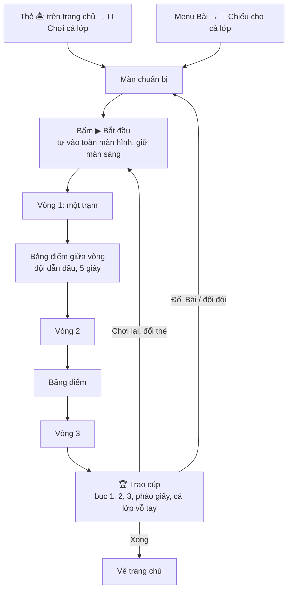
```mermaid
flowchart TD
    A[Thẻ 🏝️ trên trang chủ → 🏫 Chơi cả lớp] --> S[Màn chuẩn bị]
    B[Menu Bài → 🏫 Chiếu cho cả lớp] --> S
    S --> F[Bấm ▶ Bắt đầu<br/>tự vào toàn màn hình, giữ màn sáng]
    F --> R1[Vòng 1: một trạm]
    R1 --> SB1[Bảng điểm giữa vòng<br/>đội dẫn đầu, 5 giây]
    SB1 --> R2[Vòng 2] --> SB2[Bảng điểm] --> R3[Vòng 3]
    R3 --> E[🏆 Trao cúp<br/>bục 1, 2, 3, pháo giấy, cả lớp vỗ tay]
    E -->|Chơi lại, đổi thẻ| F
    E -->|Đổi Bài / đổi đội| S
    E -->|Xong| H[Về trang chủ]
```

**Màn chuẩn bị** (một màn, chọn xong là chơi):

```
┌────────────────────────────────────────────────────────────────────────┐
│ ‹  🏫 Chơi cả lớp                                                       │
├────────────────────────────────────────────────────────────────────────┤
│ ① Kiến thức   Lớp [ 3 ▾ ]                                               │
│   ┌──────────────────────┐ ┌──────────────────────┐ ┌────────────────┐ │
│   │ 📖 Bài hôm nay        │ │ 📚 Từ Bài … đến Bài … │ │ 🎯 Chọn chủ đề  │ │
│   │ Bài 10 Bảng nhân 7 ✔ │ │ (ôn trước kiểm tra)  │ │                │ │
│   └──────────────────────┘ └──────────────────────┘ └────────────────┘ │
│ ② Gói chơi                                                              │
│   [ ⚡ Khởi động 5 phút ] [ ✅ Củng cố 7 phút ✔ ] [ 🏆 Giải đấu 15 phút ]   │
│   hoặc một trạm: [🃏] [🙈] [🔦] [🎵] [🐢]                                  │
│ ③ Đội                                                                   │
│   [ 2 ] [ 3 ✔ ] [ 4 ]   🐬 Cá Heo   🐢 Rùa Biển   🦀 Cua Đỏ   (sửa tên)    │
│   hoặc [ 👥 Cả lớp cùng chơi, không chia đội ]                          │
├────────────────────────────────────────────────────────────────────────┤
│                       [   ▶  Bắt đầu   ]                                │
└────────────────────────────────────────────────────────────────────────┘
```

- App nhớ lựa chọn lần trước (số đội, tên đội, lớp) **trên máy đó**, tiết sau mở ra là sẵn.
- "Bài hôm nay" lấy Bài gần nhất mà giáo viên mở trong sách trên máy này; không có thì để trống cho giáo viên chọn.

### 15.4 Gói hoạt động gợi ý

| Gói | Lúc dùng | Nội dung | Thời gian |
|---|---|---|---|
| ⚡ Khởi động | Đầu giờ, ổn định lớp | 🔦 Hang Đom Đóm 6 hình, cả lớp giơ bảng con | 5 phút |
| ✅ Củng cố | Cuối tiết, sau khi dạy một Bài | 🃏 Bãi Lật Thẻ chỉ thẻ Bài đó, thi 2 đội (dãy trái, dãy phải) | 7 phút |
| 🏆 Giải đấu | Sinh hoạt lớp, tiết ôn tập | 🙈 Khỉ → 🃏 Lật thẻ → 🐢 Rùa, 3–4 đội (theo tổ), cộng điểm 3 vòng, trao cúp | 15 phút |
| 📚 Ôn kiểm tra | Trước bài kiểm tra | Trộn các Bài của đợt kiểm tra, 3 trạm | 10–15 phút |

### 15.5 Từng trạm khi chơi cả lớp

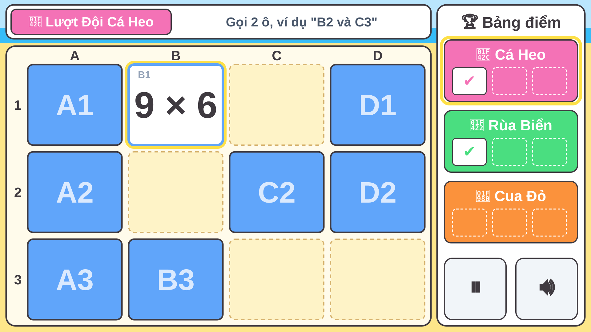

*Hình 7. Bãi Lật Thẻ trên máy chiếu, 3 đội. Thẻ úp ghi **toạ độ to** (A1…D3) để đội gọi to "B1 và C2!"; giáo viên bấm hoặc học sinh lên chạm. Bảng điểm bên phải giữ chỗ sẵn cho mọi cặp, không đổi kích thước khi có điểm.*

| Trạm | Cách chơi trên lớp | Cách tính điểm |
|---|---|---|
| 🃏 Bãi Lật Thẻ | Các đội **lần lượt**. Đội gọi 2 ô bằng toạ độ. Ghép đúng: giọng đọc đọc câu, **cả lớp đọc đồng thanh** "9 nhân 6 bằng 54!", đội đó lật tiếp. Sai: sang đội sau | 1 điểm mỗi cặp |
| 🙈 Khỉ Giấu Thẻ | **Cả lớp cùng chơi.** 4 nút ghi **A B C D** to. Hết 10 giây, mỗi đội giơ thẻ chữ (hoặc bảng con). Giáo viên bấm "Lật đáp án", rồi chạm tên các đội đúng | 1 điểm mỗi đội đúng |
| 🔦 Hang Đom Đóm | Như Khỉ: cả lớp nhìn, mỗi đội giơ A/B/C/D hoặc **viết số vào bảng con** | 1 điểm mỗi đội đúng |
| 🎵 Đàn Đá | Cả lớp **đọc to** chuỗi số theo chim. Mỗi đội cử một bạn lên chạm lại chuỗi (hoặc đọc cho giáo viên bấm). Nốt câm: cả lớp viết số tiếp theo vào bảng con | Độ dài chuỗi đội nhớ được |
| 🐢 Rùa Nhớ Đường | Cả lớp nhìn rùa đi, **tính nhẩm vào bảng con**. Giáo viên bấm "Xem lời giải", từng dòng hiện ra để cả lớp so | 1 điểm mỗi đội đúng |

- Màn trả lời hiện **đồng hồ đếm 10 giây to** và nút ⏸. Hết giờ không tự chấm, chờ giáo viên bấm, để giáo viên có thời gian hỏi "Vì sao em chọn B?".
- **Trang in thẻ A B C D** và **thẻ tên đội** (một nút "🖨️ In thẻ trả lời" ở màn chuẩn bị) cho lớp chưa có bảng con.

### 15.6 Quy tắc riêng cho màn chiếu

- **Khổ 16:9, chữ cực to:** chữ trên thẻ cao ít nhất 8% chiều cao màn (đọc được từ cuối lớp). Không có chữ phụ nhỏ trên thẻ; bỏ ô "lần lật". Mỗi đội có **màu + con vật + tên**, không chỉ dựa vào màu (máy chiếu thường nhạt màu).
- **Điều khiển bằng bàn phím và bút trình chiếu:**

  | Phím | Việc |
  |---|---|
  | `Space`, `→`, `PageDown` (nút bút trình chiếu) | Bước tiếp theo |
  | `A`–`D` hoặc `1`–`4` | Chọn đáp án |
  | Chữ + số (`B` `2`) | Lật ô B2 ở Bãi Lật Thẻ |
  | `P` | Tạm dừng / chạy tiếp |
  | `F` | Toàn màn hình |
  | `Z` | Hoàn tác lần chấm điểm vừa rồi (giáo viên bấm nhầm đội) |

- **Giữ màn sáng** (Wake Lock) và vào **toàn màn hình** khi bắt đầu.
- **Âm thanh cho loa lớp:** giọng đọc chậm hơn, to hơn; nhạc nền tắt mặc định; hiệu ứng đúng / sai ngắn.
- Vẫn theo `game-screen-layout`: bảng điểm giữ chỗ đủ cho mọi đội từ đầu, thẻ cố định kích thước, bảng điểm giữa vòng và màn trao cúp **phủ lên** bàn chơi, không đẩy bố cục.
- **Wi-Fi trường thường yếu:** bộ thẻ và hình nằm sẵn trong code, tải xong là chơi được khi mất mạng.

### 15.7 Dữ liệu khi chơi cả lớp

- **Không ghi** Rương, level, sao, sticker, bảng xếp hạng của tài khoản đang đăng nhập (thường là máy giáo viên hoặc máy của một bạn). Nếu ghi thì tài khoản đó sẽ lên top bảng xếp hạng một cách sai.
- Học sinh **không cần đăng nhập**.
- Chỉ lưu trên máy: lựa chọn lần trước và 5 ván gần nhất (ngày, Bài, đội thắng), để giáo viên xem lại.

### 15.8 Mở rộng sau: mỗi học sinh một máy

Nếu lớp có máy tính bảng cho từng em: giáo viên mở **phòng chơi có mã 4 số**, học sinh vào bằng mã, trả lời trên máy mình, màn chiếu hiện kết quả cả lớp (kiểu Kahoot). Dùng Firebase sẵn có, nhưng cần thêm luật bảo vệ trẻ em (không tạo khách, không lưu tên thật). **Chưa làm ở bản đầu**, chỉ làm khi biết trường có máy cho học sinh.

---

## 16. Tham khảo Lumosity và các game nhận thức

Đã xem các game trí nhớ, toán của **Lumosity**, bài tập của **BrainHQ** và các bài thử của **Human Benchmark** (nguồn ở cuối mục). Các game này làm cho người lớn, luyện trí nhớ "trơn" (nhớ ô, nhớ chuỗi, nhớ hình), không gắn kiến thức. Cách dùng ở đây: **lấy cơ chế, thay nội dung bằng kiến thức toán**, đặt tên và vẽ hình riêng (cơ chế chơi không có bản quyền, nhưng tên game và hình thì có, nên không chép).

### 16.1 Đối chiếu từng game

| Game tham khảo | Cơ chế | Trong Đảo Trí Nhớ | Đánh giá |
|---|---|---|---|
| Lumosity **Memory Matrix**, Human Benchmark **Visual Memory** | Vài ô trên lưới sáng lên, tắt đi, chạm lại đúng các ô. Đúng thì lưới to thêm, sai thì nhỏ lại | Chưa có. Thêm thành cấp **"Ô sáng"** của 🔦 Hang Đom Đóm (§16.5) | ✅ Phù hợp: ô sáng trên khung 10 ô, bảng 100 ô |
| Human Benchmark **Chimp Test** | Số 1–9 rải trên lưới, hiện chớp nhoáng rồi úp, chạm theo thứ tự 1, 2, 3… | Chưa có. Thêm trạm **🐚 Sò Xếp Hàng** (§16.2): thẻ là **giá trị** (`7 × 3`, `18`, `2 chục 5`), chạm từ bé đến lớn | ✅✅ Rất phù hợp: thêm được mảng **so sánh, thứ tự số** mà Đảo chưa có |
| Lumosity **Memory Match**, BrainHQ **Card Shark** (n-back) | Thẻ hiện lần lượt từng thẻ; bấm "giống" nếu thẻ này giống thẻ trước (hoặc 2 thẻ trước) | Chưa có. Thêm trạm **🚃 Tàu Bằng Nhau** (§16.3): "giống" đổi thành **bằng nhau** (`3 × 4` rồi `12` → Bằng!) | ✅✅ Rất phù hợp, hợp **trộn kiến thức** và chơi cả lớp (cả lớp hô "Bằng!") |
| Lumosity **Tidal Treasures** | Mỗi đợt sóng đưa thêm đồ vật; chọn đồ **chưa chọn lần nào** | Chưa có. Thêm trạm **🌊 Sóng Nhặt Ngọc** (§16.4): giá trị bằng nhau ở dạng khác **tính là đã nhặt** (đã nhặt `24` thì `6 × 4` là trùng) | ✅ Phù hợp, khó hơn, hợp lớp 3–5 |
| Lumosity **Follow That Frog**, Human Benchmark **Sequence Memory**, Cogmed | Ếch nhảy / ô sáng theo chuỗi, làm lại đúng chuỗi, chuỗi dài dần | Đã có: 🎵 **Đàn Đá** (thêm quy luật toán) | Đã phủ |
| Trò lật cặp cổ điển (Concentration), BrainHQ **Memory Grid** | Lật tìm cặp | Đã có: 🃏 **Bãi Lật Thẻ** (cặp bằng nhau) | Đã phủ |
| Lumosity **Pinball Recall** | Nhớ vị trí vật cản để đoán đường bóng | Gần với 🐢 **Rùa Nhớ Đường** | Đã phủ |
| Lumosity **Memory Serves**, **Playing Koi** | Theo dõi một kho / đàn cá thay đổi liên tục | Trò 🚌 Xe buýt lên xuống (lớp 2, 3) đã làm việc này với số người | Không thêm, tránh trùng |
| BrainHQ **To-Do List Training** | Nghe một dãy yêu cầu, chọn lại đúng thứ tự | Có thể thành "Nghe và làm theo" (nghe "lấy 2 kg, rồi 500 g") | ⏸ Để sau: nặng phần nghe, lớp ồn khó dùng |
| Lumosity **Familiar Faces** | Nhớ tên và món của từng khách | Không gắn kiến thức toán | ❌ Không dùng |
| Lumosity **Raindrops**, **Chalkboard Challenge** | Tính nhanh trước khi giọt mưa rơi; chọn biểu thức lớn hơn | Là luyện tính nhanh, không phải trí nhớ. Hợp với **Luyện Tính** sẵn có hoặc gói ⚡ Khởi động trên lớp | ➖ Ngoài phạm vi Đảo |

### 16.2 🐚 Trạm mới: Sò Xếp Hàng (cơ chế Chimp Test)

**Luyện:** nhớ vị trí + **so sánh, sắp thứ tự**. **Cảnh:** bãi đá có các con sò, mỗi sò ngậm một thẻ.

```
 ① Sò mở 3 giây                       ② Sò khép lại, chạm từ BÉ đến LỚN
 ┌──────────────────────────────┐     ┌──────────────────────────────┐
 │  (7 × 3)        (18)          │     │   🐚         🐚               │
 │          (2 chục 5)           │     │          🐚                   │
 │  (30 − 4)          (4 × 5)    │     │   🐚            ✅20          │ ← đã chạm đúng: sò mở,
 │                               │     │                               │   ngọc trai bay vào dây
 └──────────────────────────────┘     └──────────────────────────────┘
   ⚪ ⚪ ⚪ ⚪ ⚪  dải 5 ngọc trai (giữ chỗ)       🟡 ⚪ ⚪ ⚪ ⚪   18 < 20 < 21 < 25 < 26
```

- Thứ tự đúng: `18` < `4 × 5` (20) < `7 × 3` (21) < `2 chục 5` (25) < `30 − 4` (26).
- Chạm sai → sò mở hết, xếp hàng đúng trên dải ngọc kèm dấu `<`, vẹt đọc "18 bé hơn 20, bé hơn 21…".
- Đúng cả lượt → thêm 1 sò ở lượt sau (như Chimp Test). Sai 2 lần ở cùng số sò → hết ván.

| Lớp | Thẻ trong sò | Bài |
|---|---|---|
| 1 | Số 0–10, chấm khung 10 ô | Bài 10–13 (bé hơn, lớn hơn, bằng nhau) |
| 2 | Số 2 chữ số, 3 chữ số; khối trăm chục | Bài 1, 50, 53 |
| 3 | Phép nhân, chia trong bảng; số 4, 5 chữ số | Bài 5–12, 46, 60 |
| 4 | Số đến lớp triệu; đơn vị đo khác nhau (`1 tạ`, `90 kg`, `1 yến`) | Bài 14, 17 |
| 5 | Số thập phân, phân số, hỗn số | Bài 3, 7, 11 |

**Bậc:** B1 4 sò, mở 4 giây · B2 5 sò, 3 giây · B3 6 sò, trộn dạng (số + phép tính + hình) · B4 thêm luật "từ LỚN đến BÉ".
**Cả lớp:** sò đánh số A–F; đội đọc to thứ tự "C, A, E…", giáo viên bấm.

### 16.3 🚃 Trạm mới: Tàu Bằng Nhau (cơ chế n-back)

**Luyện:** giữ thẻ vừa qua trong đầu + nhận ra **hai cách viết cùng một giá trị**. **Cảnh:** đoàn tàu chạy qua ga, mỗi toa chở một thẻ.

```
            toa vừa qua (đã úp)            toa đang vào ga
   🚂 ═══ [ ▓▓▓▓▓ ] ═══════════════ [  12  ] ═══▶
                                                      ┌──────────────┐ ┌──────────────┐
   "Toa này có BẰNG toa trước không?"                  │   ✅ Bằng!    │ │  ❌ Không     │
                                                      └──────────────┘ └──────────────┘
```

- Toa trước chở `3 × 4` rồi úp lại khi toa mới vào. Toa này chở `12` → bấm **Bằng!**
- Một ván 20 toa (khoảng 1 phút), khoảng 1/3 số toa là "bằng". Có thẻ **gần bằng** để bẫy (`3 × 4` rồi `14`).
- Không bấm giờ cứng: toa đứng đợi tới khi bé bấm, chỉ chấm thêm "⚡ nhanh" nếu bấm dưới 3 giây.

**Bậc:** B1 so với **toa ngay trước**, cùng chủ đề · B2 trộn 2–3 chủ đề · B3 so với **2 toa trước** · B4 thẻ hình (đồng hồ, khối, hình tô) xen thẻ số.
**Nội dung:** lấy thẳng từ kho thẻ §12 (mọi thẻ có ≥ 2 mặt đều dùng được), nên trạm này có cho **mọi lớp, mọi chủ đề** ngay khi có kho thẻ.
**Cả lớp:** rất hợp. Toa vào ga, cả lớp **hô "Bằng!"** hoặc **giơ tay**, giáo viên bấm. Thi đội: mỗi đội một lượt 5 toa.
**Ghi Rương:** mỗi lần bấm đúng "Bằng" là một câu trả lời đúng cho thẻ đó.

### 16.4 🌊 Trạm mới: Sóng Nhặt Ngọc (cơ chế Tidal Treasures)

**Luyện:** nhớ những gì đã chọn khi danh sách cứ dài thêm + nhận ra giá trị bằng nhau. **Cảnh:** vũng thủy triều, mỗi đợt sóng đưa thêm vỏ ốc có thẻ.

1. Sóng 1 đưa 3 vỏ ốc: `24`, `1/2`, `9`. Bé chạm một vỏ, ví dụ `24` → bỏ vào giỏ (giỏ **úp**, không nhìn được).
2. Sóng 2 trộn lại, thêm 1 vỏ: `6 × 4`, `1/2`, `9`, `2/4`. Bé phải chọn vỏ **chưa có trong giỏ**: `6 × 4` là **trùng** (bằng 24), `2/4` cũng trùng nếu đã nhặt `1/2`.
3. Chọn trùng → sóng cuốn mất vỏ, hết ván. Ván dài dần tới 10–12 sóng.

**Hợp lớp 3–5** (cần nhận ra dạng bằng nhau). Lớp 1, 2 dùng bản dễ: chỉ thẻ số, không có dạng khác.
**Cả lớp:** khó theo dõi chung, chỉ dùng ở chế độ tự chơi.

### 16.5 Cấp mới "Ô sáng" cho 🔦 Hang Đom Đóm (cơ chế Memory Matrix)

Đom đóm đậu sáng trên vài ô của một **khung toán** rồi bay đi; bé chạm lại đúng các ô đó, rồi trả lời một câu:

| Lớp | Khung | Đom đóm đậu | Câu hỏi sau khi chạm lại |
|---|---|---|---|
| 1 | Khung 10 ô | 7 ô | "Có mấy đom đóm?" (7 = 5 + 2) |
| 2 | Bảng 100 ô | Các ô 5, 10, 15, 20 | "Số tiếp theo là số nào?" |
| 3 | Bảng nhân 10 × 10 | Các ô tích bằng 12 | "Những phép nhân nào bằng 12?" |
| 4, 5 | Lưới ô vuông | Một hình | "Diện tích bao nhiêu ô vuông?" |

Như Memory Matrix: đúng thì lượt sau **thêm 1 đom đóm**, sai thì bớt 1, nên độ khó tự vừa sức bé.

### 16.6 Những điều nên học thêm từ các game này

| Điều học được | Áp dụng |
|---|---|
| **Một ván rất ngắn** (Lumosity khoảng 1–2 phút) | Ván tự chơi 1–3 phút; Tàu Bằng Nhau 20 toa khoảng 1 phút |
| **Tự chỉnh độ khó ngay trong ván** (đúng thì khó lên, sai thì dễ xuống) | Sò Xếp Hàng (thêm, bớt sò), Ô sáng (thêm, bớt đom đóm), Hang Đom Đóm (thời gian sáng) |
| **Chuỗi đúng liên tiếp** tăng thưởng | Đúng 5 lần liền: vẹt tung hoa, thẻ sau được ⭐ đôi. Không trừ điểm khi sai |
| **Biểu đồ tiến bộ cá nhân** theo ngày | Trang phụ huynh của Rương: số thẻ 💎 theo tuần. **Không** so sánh "hơn bao nhiêu % bạn cùng tuổi" như Lumosity, vì dễ làm bé nản |
| Lumosity nhấn tốc độ, đếm giờ gắt | **Không** đếm giờ gắt với lớp 1, 2; tốc độ chỉ là phần thưởng thêm (⚡) |

### 16.7 Đề xuất cập nhật danh sách trạm

- **Thêm ngay:** 🚃 **Tàu Bằng Nhau** và 🐚 **Sò Xếp Hàng**. Cả hai dễ làm (dùng lại kho thẻ), rất hợp chơi cả lớp, và Sò Xếp Hàng thêm được mảng so sánh / thứ tự số.
- **Thêm sau:** 🌊 **Sóng Nhặt Ngọc** (lớp 3–5, tự chơi), cấp **Ô sáng** của Hang Đom Đóm.
- Đảo khi đó có **7 trạm**. Khuôn level (§5.2) dùng thêm: level 4 có thể là Tàu Bằng Nhau, level 2 có thể là Sò Xếp Hàng khi vùng là "so sánh số".

Nguồn tham khảo:
[Lumosity Memory Games](https://www.lumosity.com/en/brain-games/memory-games/) ·
[Lumosity Memory Matrix](https://www.lumosity.com/en/brain-games/memory-matrix/) ·
[Lumosity Math Games](https://www.lumosity.com/en/brain-games/math-games/) ·
[Lumosity Raindrops](https://help.lumosity.com/hc/en-us/articles/360048982714-Raindrops-Instructions) ·
[Lumosity Chalkboard Challenge](https://help.lumosity.com/hc/en-us/articles/360042603513-Chalkboard-Challenge-instructions) ·
[BrainHQ Card Shark](https://support.brainhq.com/hc/en-us/articles/200741589-Card-Shark) ·
[BrainHQ To-Do List Training](https://support.brainhq.com/hc/en-us/articles/201141485-To-Do-List-Training) ·
[BrainHQ Memory Grid](https://support.brainhq.com/hc/en-us/articles/201141265-Memory-Grid) ·
[Chimp Test](https://measurehuman.com/guides/chimp-test)

---

## 17. Câu hỏi cần chốt

| # | Vấn đề | Đề xuất |
|---|---|---|
| 1 | Tên trò và bối cảnh | 🏝️ **Đảo Trí Nhớ** với 5 trạm như trên |
| 2 | Làm lớp nào trước | **Lớp 3** (bảng nhân chia là thứ cần thuộc nhất), rồi lớp 2 |
| 3 | Có bấm giờ không | Không bấm giờ ở Bãi Lật Thẻ, Đàn Đá, Rùa. Chỉ Khỉ và Hang có thời gian **nhìn** (là một phần luật chơi) |
| 4 | Sai trong Rương lùi mấy hạng | Lùi 2 hạng (không về đầu) |
| 5 | Chơi hai người cùng máy | Có, ở Bãi Lật Thẻ, không tính sao |
| 6 | Nhắc ôn | Chỉ chấm đỏ 🔔 trên thẻ trang chủ, không thông báo đẩy, không đếm chuỗi ngày |
| 7 | Vị trí trong app | **Thẻ riêng 🏝️ ở đầu danh sách mỗi lớp trên trang chủ** (rộng gấp đôi), mở ra 👦 Tự chơi / 🏫 Chơi cả lớp; thêm nút "🏫 Chiếu cho cả lớp" trong menu mỗi Bài (§15.1) |
| 8 | Level có khóa không | **Không khóa cứng**: level chưa tới vẫn chơi được, có lời báo "khó hơn" (§5.5). Nếu muốn cảm giác "mở màn" thì đổi sang khóa mềm: phải qua level trước, nhưng có nút "Em đã học bài này" để nhảy vùng |
| 9 | Lối chơi chính trên bản đồ | Nút to nhất là **▶ Đi tiếp** (level); chơi tự do và Chuyến đi hôm nay là nút phụ |
| 10 | Thiết bị trên lớp | Thiết kế cho **laptop + máy chiếu / TV** (giáo viên bấm, bút trình chiếu). Nếu lớp có bảng / TV cảm ứng thì học sinh lên chạm trực tiếp. Cần biết trường thường có loại nào |
| 11 | Ưu tiên làm chế độ nào trước | Vì dùng nhiều trên lớp: làm **🏫 Chơi cả lớp** ngay sau trạm đầu tiên (lộ trình giai đoạn 1b), trước Rương và level |
| 12 | Mỗi học sinh một máy (mã phòng) | Chưa làm ở bản đầu (§15.8) |
| 13 | Thêm trạm theo Lumosity / game nhận thức | Thêm ngay 🚃 **Tàu Bằng Nhau** (n-back) và 🐚 **Sò Xếp Hàng** (Chimp Test); để sau 🌊 Sóng Nhặt Ngọc và cấp Ô sáng (§16.7) |
